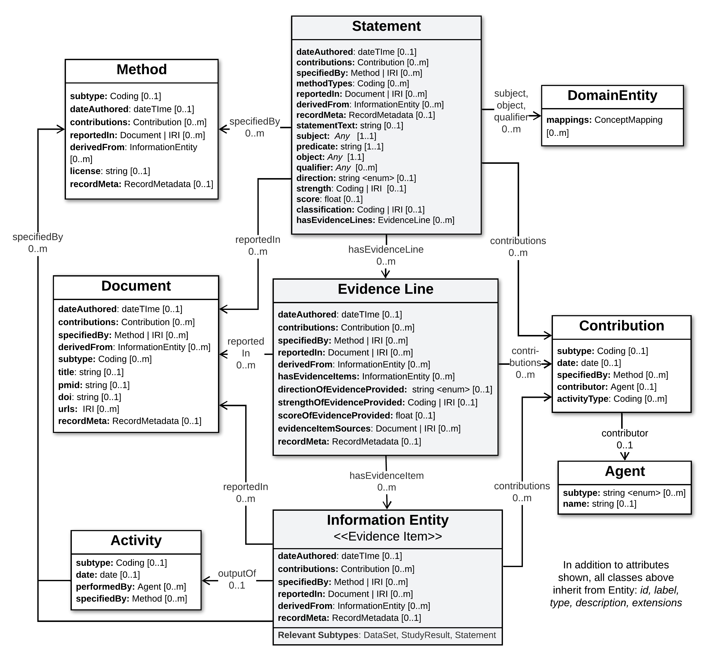

.. _statement-profiles:

Proposition Profiles
!!!!!!!!!!!!!!!!!!

In the **GKS-Core-IM**, each discrete assertion of knowledge is captured in a self-contained ``Proposition`` object which roots a :ref:`data structure <core-im-statement-data-structure>` supporting rich and flexible descriptions of the evidence and provenance supporting this knowledge. 

**Proposition Profiles** are defined as specializations of this Core-IM ``Proposition`` class, to provide a concrete schema for representing a particular type of Variant knowledge (e.g. variant pathogenicity classifications).

The basic structure of Proposition Profiles built on the Core-IM is illustrated below. The process used to specialize this structure for a specific Statement type is described in the :ref:`Profiling Methodology<profiling-methodology>`.

.. _statement-data-structure:

   Statement Data Structure

   **Legend** A view of the core data structure rooted by the Statement class, which can be leveraged in defining a Proposition Profile. This view focuses on the most important and commonly used attributes and relationships in the model. Note that specific subtypes of InformtionEntity are listed at the bottom of this Class, but not shown for space.  See Core-IM pags for these classes for details. 
---------

Below are the **Standard Proposition Profiles** currently defined as part of the VA-Spec, and available for adoption or extension by Driver Project implementations. **JSON Schema** for each Profile can be found `here <https://github.com/ga4gh/va-spec/tree/1.x/schema/profiles/json>`_. 

.. _variant-pathogenicity-proposition-profile:

Variant Pathogenicity Proposition
#################################

.. include::  ../def/va-spec/VariantPathogenicityProposition.rst

Variant Oncogenicity Study Proposition
######################################

.. include::  ../def/va-spec/VariantOncogenicityStudyProposition.rst

Variant Therapeutic Response Study Proposition
##############################################

.. include::  ../def/va-spec/VariantTherapeuticResponseStudyProposition.rst

.. _variant-diagnostic-statement-profile:

Variant Diagnostic Study Proposition
####################################

.. include::  ../def/va-spec/VariantDiagnosticStudyProposition.rst

Variant Prognostic Study Proposition
####################################

.. include::  ../def/va-spec/VariantPrognosticStudyProposition.rst

