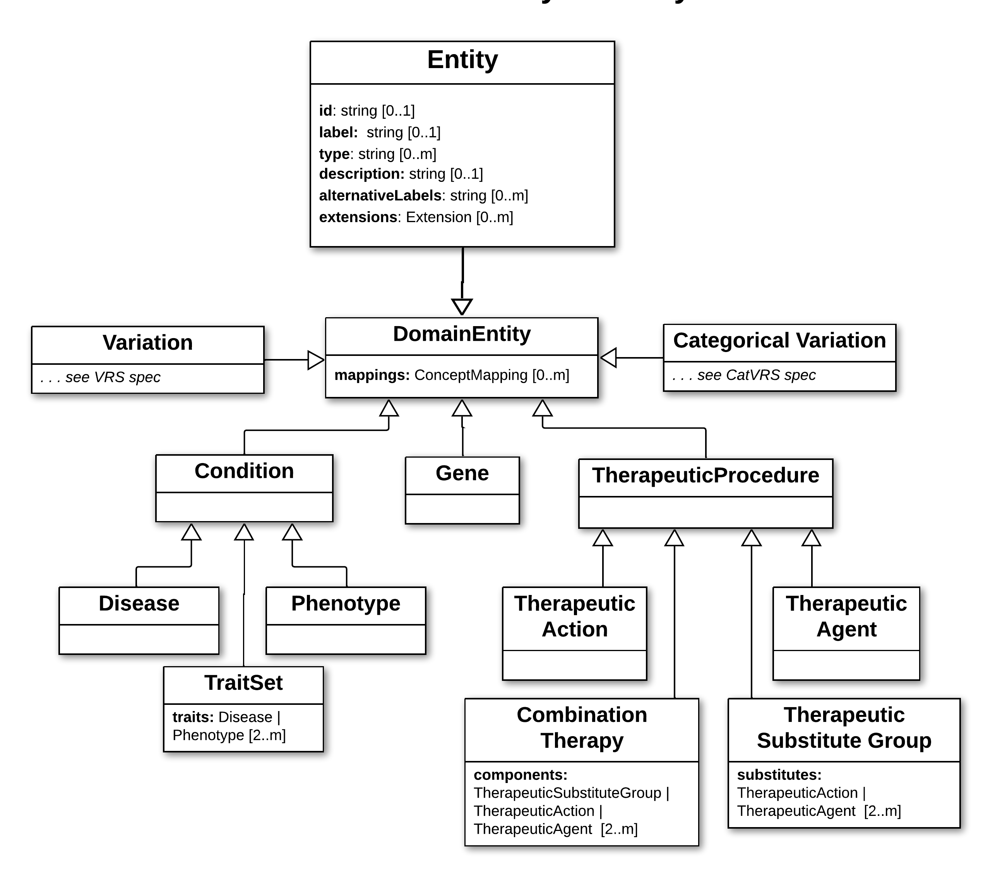

.. _DomainEntity:

Domain Entity
!!!!!!!!!!!!!

.. include::  ../../../../../schema/core-im/def/DomainEntity.rst

.. core-im-class-hierarchy:

**Domain Entity Class Hierarchy**

Note that these are minimally specified models at present, which will be evolved into more robust models with broad community input. 

   **Legend** Hierarchical structure of Domain Entity classes in the VA-Spec.

**Subclasses**

.. toctree::
   :titlesonly:

   gene
   conditions/index
   therapeutic-procedures/index
 
