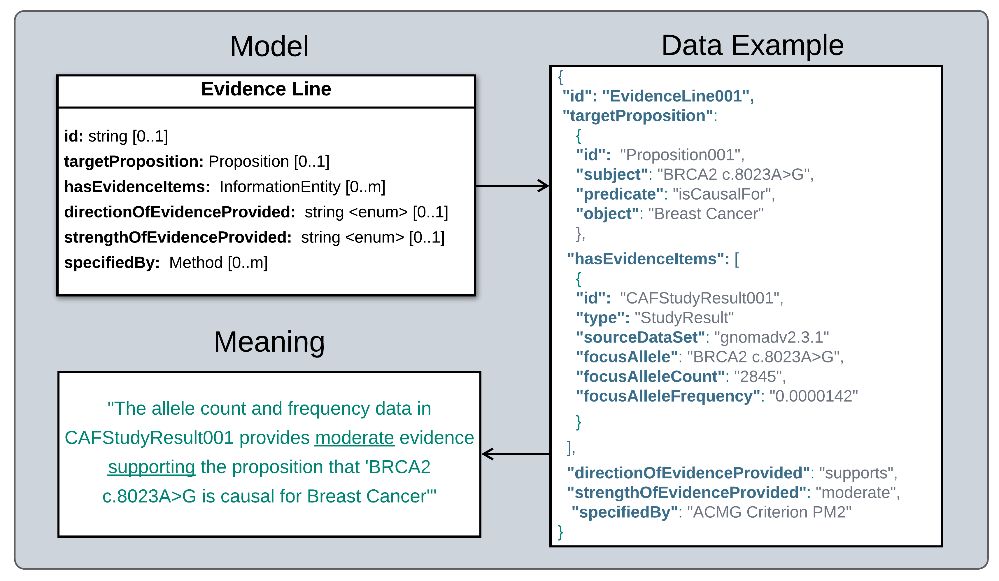

.. _EvidenceLine:

Evidence Line
!!!!!!!!!!!!!

.. include::  ../../../../../schema/core-im/def/EvidenceLine.rst  

**IMPLEMENTATION GUIDANCE**

**1. Attaching Evidence to Statements**

The SEPIO-VA model can represent the fact that a piece of information (e.g. a Data Set, Study Result, or prior Statement) was used as **evidence** for or against a new Statement in one of two ways, depending on how much detail is provided/desired:

* If the source data includes details about how the information was interpreted and applied as evidence (e.g. the direction and strength it provides for or against the target Statement, and provenance infroamtion about how this was assessed) - an ``EvidenceLine`` object is created to capture this detail (see below for more).
* For simpler data that merely reports that some piece of information was used as evidence supporting a Statement,  a ``hasEvidence`` relation can be used to link the Statement directly to objects representing the information used as evidence (without the need to create an intervening ``EvidenceLine``).

**2. Meaning and Utility of Evidence Lines**

* Evidence Lines are used to capture one or more pieces of information (i.e. **evidence items**) that are assessed together as an argument for or against some **target proposition** - and report the **direction** (supports or disputes) and **strength** (e.g. strong, moderate, weak) that the argument is determined to make. 
* For example, the allele count and frequency calculations for the BRCA2 c.8023A>G variant in the gnomAD database are evidence items that may be collectively assessed to build an EvidenceLine making argument of moderate strength that supports a target proposition that the variant is pathogenic for Breast Cancer. 

* In an EvidenceLine instance, the ``targetProposition`` attribute reports the 'possible fact' that the evidence is assessed against. The ``evidenceItems`` attribute captures the information assessed as evidence. And the ``directionOfEvidenceProvided`` and ``strengthOfEvidenceProvided`` attributes report the outcome of this assessment - whether the evidence line supports or disputes the target proposition, and how strongly. Additional attributes allow provenance information about the evidence assessment process to be captured (who did it, when, using what guidelines, etc). 

**3. Evidence Line Scope**

* Evidence Lines are flexible with respect to the granularity of arguments they support, and the scope of evidence items they can collectively assess. 
* Narrow scoping will bucket available evidence into many, fine-grained Evidence Lines that make the most atomic independently meaningful arguments possible. The ACMG Variant Pathogenicity Interpretation Guidelines are an example of a fairly fine-grained evidence interpretation framework. 
* Broader scoping approaches may organize the same available evidence into fewer Evidence Lines that build and assess less atomic arguments based on a wider and more diverse set of evidence items.  For example, CIViC curators assess the strength and direction of evidence items at the level of *all information reported in a publication for a specific study* - which can encompass many different results and evidence types that under more fine-grained interpretation approaches might be split apart and assessed as separate lines of evidence. 
* This CIViC EID5682 record (https://civicdb.org/evidence/5682/summary) is a clear example of this. We see here that CIViC evidence assessments are performed at the level of all results reported in PMID:23143947 - which would captured as a single Evidence Line that assigns a strength (level C) and direction (supports) to the collective argument made by this evidence.  However, as detailed in the free-text summary of this EID, the more fine-grained ACMG framework breaks out and separately assess two arguments here - one based on criterion PP1 (disease co-segregation evidence), and one based on criterion PP4 (highly specific gene-phenotype information) - which a finer-grained representation would capture as two distinct Evidence Lines.   
* This example illustrates the flexible scope of Evidence Lines to fit different curation processes- where ACMG-based curation might assess evidence at a finer-grained level that would support a larger number of more atomic Evidence Lines, while CIViC curators might assess the same evidence all together in a single, more broadly-scoped Evidence Line - in virtue of its being reported in the same publication.
