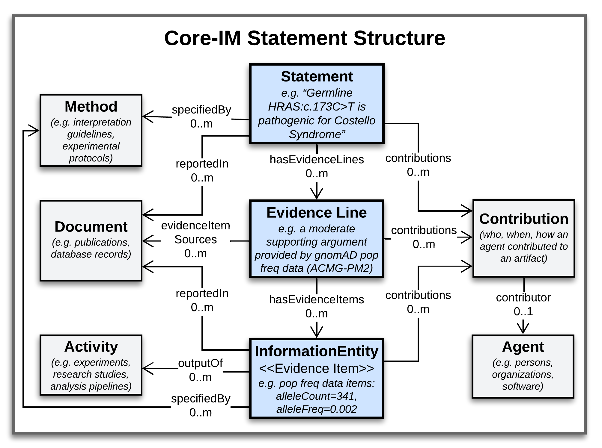

.. _Statement:

Statement
!!!!!!!!!

.. include::  ../../../../../schema/core-im/def/Statement.rst

----------

**DATA STRUCTURE**

The Core-IM supports a Statement-centric approach, where each discrete assertion of knowledge is captured in a self-contained **Statement** object which roots a data structure like that in the figure below. 

.. core-im-statement-data-structure:

   Core-IM Classes and Relationships in Statement Data Structures

   **Legend** A class-level view of the Statement-based structures that manifest in VA-Spec data. Italicized text under class names illustrate the kind of information each class may report, in the case of a Variant Pathogenicity Statement supported by Population Allele Frequency evidence.

In this structure:
 * A **Statement** object roots a central axis where it is linked to one or more **Evidence Lines** representing discrete arguments for or against it.
 * Each **Evidence Line** may then be linked to one or more **Evidence Items** - specific **Information Entities** that were used to build an evidence-based argument. 
 * Surrounding this central axis are classes that describe the provenance of these artifacts, including **Contributions** made to them by **Agents**, **Activities** performed in doing so, **Methods** that specify their creation, and **Documents** that describe them. 

A simple data example illustrating the structure for a Variant Pathogenicity Statement can be found :ref:`here<variant-pathogenicity-statement-example>`.

---------

**IMPLEMENTATION GUIDANCE**

**1. Statement Semantics**

Statements put forth a Proposition that expresses some possible fact about the world, and may provide an assessment of this proposition's validity (i.e. how likely it is to be true or false based on evaluated evidence). The semantics of the Proposition are captured in the ``subject``, ``predicate``, ``object``, and optional ``qualifier`` attributes. An assessment of the Proposition's  validity can be captured using ``direction``, ``strength``, and ``score`` attributes. 

* The ``direction`` attribute is used to indicate whether the Statement's Proposition is **supported** by the agent's assessment (when evidence favors its validity), is **disputed** by the agent's assessment (when evidence argues against its validity), or remains **neutral** (when conflicting or insufficient evidence exists to assert one direction or the other). Values come from an enumerated set of strings defined in the model {'supports', 'disputes', 'neutral'}.

* The ``strength`` attribute is used to report the strength of this assessment in the direction indicated. Strength can be framed as a **level of confidence** that the Proposition is true or false, or as a **level of evidence** that supports or disputes it. Data creators can define the permissible values for the strength attribute to indicate which of these facets is being assessed (e.g. 'high confidence' vs 'low confidence', or 'strong evidence' vs 'weak evidence') - or they can choose values that don't commit to one or the other if they don't want to make the distinction (e.g. 'high' vs 'medium' vs 'low'). Values in the data are representied using instnaces of a ``Coding`` object.

* The ``score`` attribute serves the same purpose as 'strength', but allows for a quantitative assessment based on a numerical score.

**2. Statement 'Modes of Use'**
The model supports two "modes of use" for Statements, which differ in what they say about their Proposition, and can be distinguished by how ``direction`` and ``strength`` or ``score`` attributes are populated. 

#. In **"Assertion Mode"**, a Statement simply reports an SPOQ proposition to be true or false (e.g. that "BRCA2 c.8023A>G is pathogenic for Breast Cancer"). The``strength` and ``score`` attributes are not populated, and ``direction`` is assumed true/supports if not otherwise indicated.  This mode is used by project reporting conclusive assertions about a domain of discourse, but not providing confidence or evidence level assessments.

#. In **"Proposition Assessment Mode"**, a Statement describes the overall state of evidence and/or confidence surrounding the SPOQ proposition - which is not necessarily being asserted as true. The ``direction`` and ``strength`` or ``score`` attributes are populated, which allows for Statements to report things like "there is *weak* evidence *supporting* the proposition that 'BRCA2 c.8023A>G is causal for Breast Cancer'", or "we have *high confidence* that the proposition 'PAH:c.1285C>A is causal for Phenylketonuria is *false*").  This mode is used in projects to track the evolving state of support for propositions of interest, as curators actively collect evidence and work toward a conclusive assertion.  

For a diagrammed example of each mode of use, see `here <https://va-ga4gh.readthedocs.io/en/latest/modeling-foundations.html#statement-semantics>`_.

.. note::  Many VA Standard Profiles, including the Variant Pathogenicity Statement Profile, contain the ``direction``, ``strength``, and ``score`` attributes, and thus could be use to support either Mode of Use. Implementations should choose the mode that best fits their data and use case when generating VA-compliant datasets - leveraging Proposition Assessment Mode if they wish to provide nuanced representations of the state of evidence or confidence surrounding a possible fact. 

**3. Use of the** ``Statement.qualifier`` **Attribute:**

* This attribute allows representation of more complex, n-ary statements that may not be accommodated by a simple subject-predicate-object (SPO) triple. For example, if an SPO triple asserts that 'Variant X' - predicts sensitivity to - 'Treatment Y', a qualifier can be used to indicate that this applies in the context of a particular 'Disease Z'. 
* Qualifiers can also add information that quantifies aspects of a Statement - e.g. for a Statement triple asserting that a 'Variant X'- causes - 'Phenotype Y', a qualifier can be used to add frequency/penetrance information that quantifies the percentage of carriers in which the phenotype is observed to manifest. Statement profiles may define more than one qualifier, as needed to capture different types of qualifying information. 
* The Core-IM specifies use of a key-value 'Qualifier' object to capture the meaning and value of each type of qualifying information relevant for a given type of Statement. But in practice, profiles for specific Statement types may choose to define one or more specializations of the generic 'qualifier' property as named attributes. This makes the data more succinct and parsable, and allows specific constraints to be applied and validated for different qualifiers. 
* For example, a VariantPathogenicityStatement profile may define a named ``alleleOriginQualifier`` attribute that is required, and a named ``geneContextQualifier`` attribute that is optional - both of which conceptually specialize the Core-IM ``qualifier`` property. Under this approach, the core 'qualifier' acts as a placeholder to seed such specializations, but is not used directly in Statement profiles.
* In practice, the Core-IM ``qualifier`` attribute SHOULD always be specialized when defining a Statement Profile, to indicate specific types of qualifying information that is being provided (e.g.``diseaseContextQualifier``, or ``penetranceQualifier``). The base ``qualifier``cattribute in the core model acts as a placeholder to seed such specializations, but it, or the ``Qualifier`` class, SHOULD NOT be used directly in a Statement profile. 
