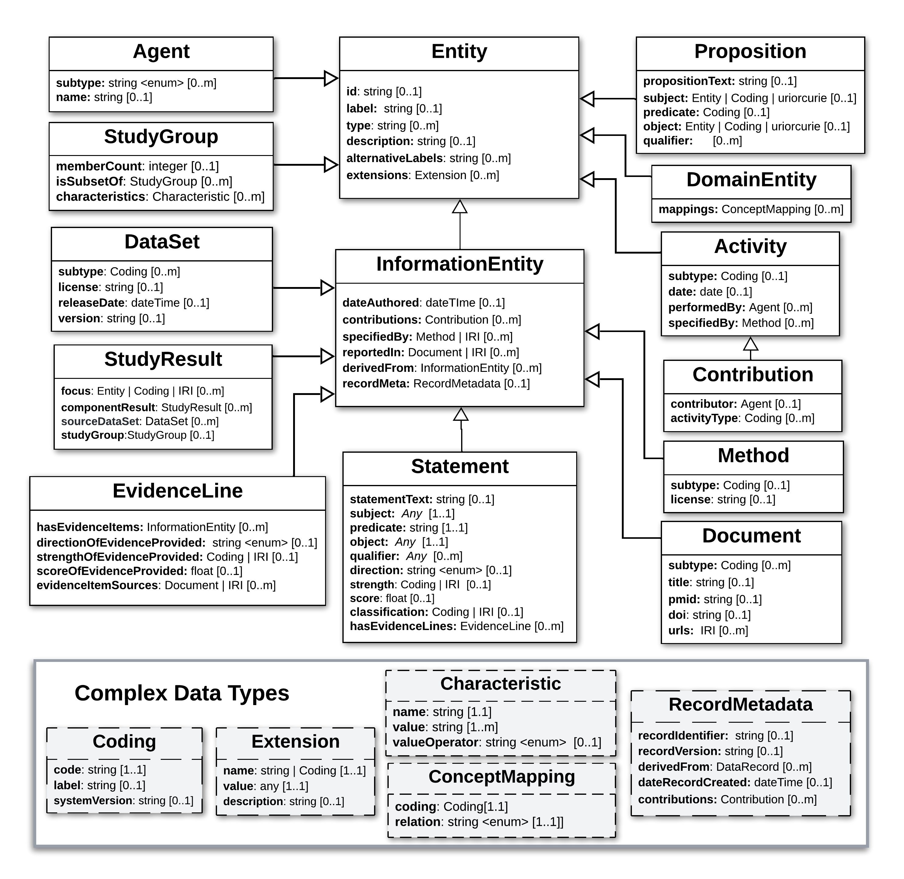

.. va-core-model:

VA Core Model
!!!!!!!!!!!!!

The **VA Core Model** is a domain-agnostic model that supports explicit representation of scientific knowledge, and the evidence and provenance supporting it. The initial version was derived from the `SEPIO Core Information Model <https://sepio-framework.github.io/sepio-linkml/gks-core-diagram/>`_, through selection of elements needed to support initial VA implementation use cases. The VA Core Model is the foundation on which Profiles for specific types of Statements, Study Results, evidence Lines, and Propositions are built.  

A hierarchical view of the VA Core Model is illustrated below, followed by links to detailed information about each class. More about the modeling standards, patterns, and principles employed by the Core Model can be found on the :ref:`Modeling Foundations page<modeling-foundations>`. 

.. gks-core-class-hierarchy:

   Core Class Hierarchy

   **Legend** Hierarchical structure of classes and attributes comprising the domain-agnostic VA Core Model. Note that a hierarchy of Domain Entity classes has been defined to represent things like Genes, Conditions, and Therapeutic Procedures. This if described separately `here <https://github.com/ga4gh/va-spec/edit/1.x/docs/source/core-information-model/entities/domain-entities/index.rst>`_. 

.. toctree::
   :maxdepth: 4
   :caption: VA Core Model Classes

   entities/index
   elements/index
   data-types
   domain-entities
