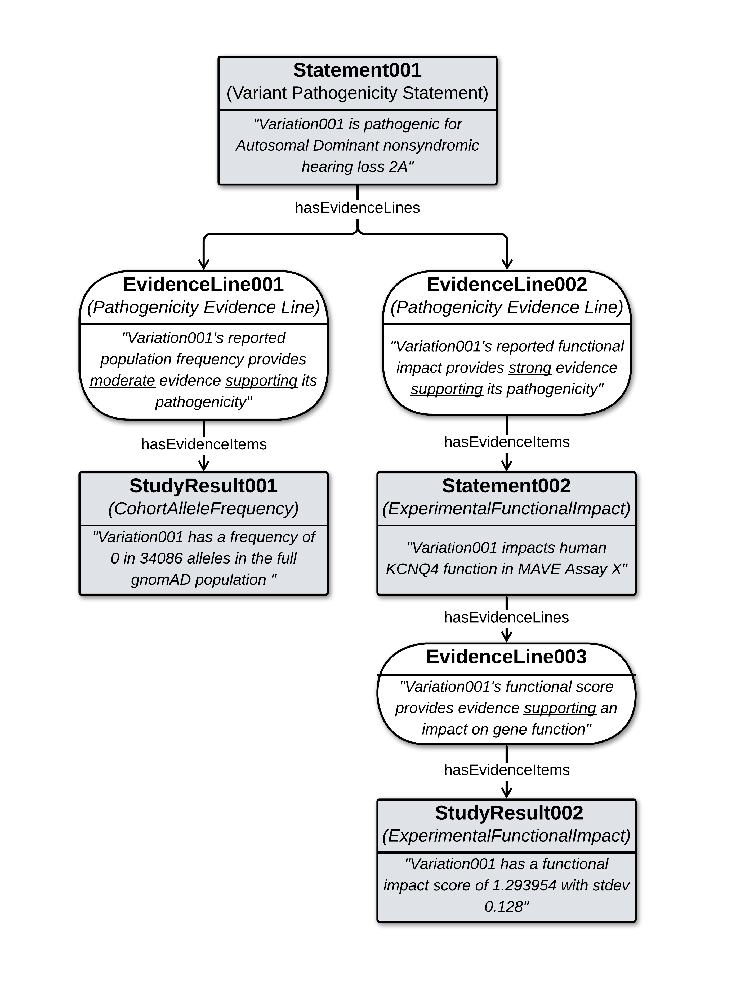

.. _variant-pathogenicity-statement-with-evidence:

Variant Pathogenicity Statement, with Evidence
!!!!!!!!!!!!!!!!!!!!!!!!!!!!!!!!!!!!!!!!!!!!!!

**Description:**

* The data below builds on the simple "ClinVar-GKS" example described :ref:`here <variant-pathogenicity-statement-simple>`, embellishing the `ClinVar SCV000778434.1 record <https://www.ncbi.nlm.nih.gov/clinvar/RCV000656422.10/>`_ with additional evidence to demonstrate richer structures the :ref:`VariantPathogenicityStatement (ACMG 2015) profile<variant-pathogenicity-statement-acmg-2015> can support.
* It stitches together several more atomic examples of Statements, Study Results, and Evidence Lines from the `test fixtures <https://github.com/ga4gh/va-spec/tree/1.0.0-ballot.2025-03/tests/fixtures>`_ directory, to reveal how these classes can be combined to build rich evidence and provenance structures for ACMG-based Pathogenicity classifications. 
* The diagram below illustrates the high level structure of the data in this example, where a root **Pathogenicity Statement** is supported by **Evidence Lines** based on a **Cohort Allele Frequency Study Result** from `gnomAD<https://gnomad.broadinstitute.org/>`_, and a **Functional Impact Statement** from `MAVE DB<https://mavedb.org/>`_ (which itself is supported by a **Functional Impact Study Result**). 
			
.. variant-pathogenicity-statement-with-evidence:

   High Level Structure of the Data Example

   **Legend** Structure of the data in in the example. Boxes represent objects comprising the central axis of the data, with descriptions indicating what each object reports to be true. The narrative to the side illustrtes how these evidence structures are interpreted to build up support for the root Pathogeicity Statement.

A few additional notes about this example:
* Some identifiers not present in the source test fixture data were created for purposes of identifying and cross-referencing objects in this aggregate example (these are all prefixed with the string 'ex:').
* It omits full representations of `VRS <https://github.com/ga4gh/vrs>`_ and `CatVRS <https://github.com/ga4gh/cat-vrs>`_ Variation objects that are subjects of Statements and Study Results in the data - as these are large structures that are the remit of other GKS Specifications.
* Comments in the yaml are provided to help readers better understand the structure, semantics, and utility of the data in the example.
