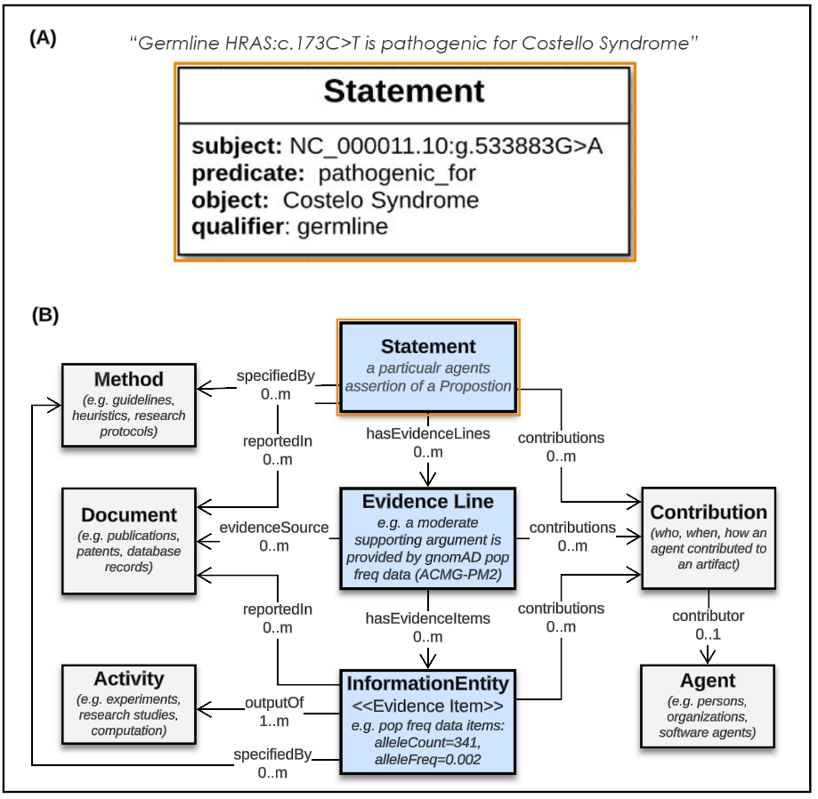

FAQ
!!!

  
What is a Variant Annotation?
#############################
To appreciate modeling and development choices made for the VA-Spec, it helps to understand
how we define and think about the content of a Variant Annotation.

**Definition**:  
   “A **structured data object** that holds a **central statement of knowledge** about a **molecular variation**, 
   along with **evidence and provenance metadata** supporting it.

     * **‘structured data object’**: an organized, computable representation of knowledge, in any format or syntax.
     * **‘central statement of knowledge’**: the single primary statement about a molecular variation is at the core of an annotation.
     * **‘molecular variation’**: defined broadly to cover sequence changes, epigenetic modifications, or alterations in gene expression or location (see `Variant`_). 
     * **‘evidence and provenance metadata’**: describes how the central knowledge statement was generated, including when, by whom, and using what methods and evidence information.

The VA-Spec model was  defined to *explcitly represent* and *clearly distinguish* these key types of information within a Variant Annotation - so that users can appreciate the significance and utility of the knowledge they provide.

.. image:: images/annotation-definition.PNG
  :width: 700
  
What types of variants are covered by the VA-spec?
##################################################
  
Variants are the subjects of the knowledge statements that the VA-Spec was built to support. We define the notion of 'variant' broadly
to cover the diversity of targets annotated with knowledge in variant curtaion efforts and knowledgebases.

**Definition**: 
    Alternative forms of a genetic sequence, or of its molecular manifestation in a biological system. (Also referred to as a 'molecular variations'). 

    Covers *sequence variations* in a genome, transcript, or protein.
     * **simple** (SNV, indels) or **complex** (inversions, repeat regions) sequence changes
     * **continuous** (allele) or **discontinuous** (translocations) regions
     * **in cis** (haplotypes) or **in trans** (genotypes) sets of variant regions

    Covers *post-sequence* variations in the state of a program that unfolds 'downstream' of sequence 
     * changes in **expression level** or **location** of a gene product
           e.g. decreased cytosolic expression of the MYOD1 gene
     * changes in **post-translational modification** of proteins 
           e.g. increased PEST domain phosphorylation of the GADD34 gene
     * changes in **epigenetic alterations** of a gene or region
           e.g. increased AKT1 enhancer methylation

    Covers different levels of **'represenational specificity'** at which these variations can be described
     * **Discrete Variation**:  specific instances of a sequence variation in a specified context (reference, location, state - even if incompletely known). 
            e.g. the NC_000019.9:g.45411941T>C genomic allele (`link <https://gnomad.broadinstitute.org/variant/19-45411941-T-C>`_)
     * **Expansion Sets**: sets of Discrete Variation instances that are related via lift-over, or projection functions (or combinations thereof). 
            e.g. the set of discrete varaints in ClinGen 'canonical allele' CA127512 (`link <http://reg.clinicalgenome.org/redmine/projects/registry/genboree_registry/by_caid?caid=CA127512>`_)
     * **Categorical Variation**: rule-based classes of variation defined by specific membership criteria.  
            e.g. ‘deletions spanning EGFR exon 4’ (`link <https://civicdb.org/variants/252/summary>`_), ‘TSC1 loss-of-function muts.’ (`link <https://civicdb.org/variants/125/summary>`_)

The VA-Spec uses the `GA4GH Variant Representation Specification (VRS) <https://vrs.ga4gh.org/en/stable/index.html>`_ as a standard for identifying and representing these different forms of molecular variation.
  
  
What types of variant knowledge are covered by the VA-Spec?
###########################################################
The VA-Spec supports annotation statements about the **biological** and **clinical** significance of a variant, but leaves those
reporting **case-level observations** about a variant to other standards (e.g. Phenopackets, HL7-Clinical Genomics IM, FHIR)

 * **Biological Variant Statements**  ``IN-SCOPE``: e.g. Molecular Consequence, Functional Impact, Population Frequency, Relative Location, Evolutionary Conservation
 * **Clinical Knolwedge Statements**  ``IN-SCOPE``: e.g. Pathogenicity Classification, Therapeutic Response Classification, Diagnostic Classification, Prognostic Classification, Phenotypic Feature Association
 * **Case-Level Knowledge Statement**  ``OUT-OF-SCOPE``:  e.g. observation of a variant in a patient, disease causality of an observed variant in a patient, origin of an observed variant in a patient, clonality of a variant in a patient - these kinds of information are not covered by the VA-Spec.

What is the SEPIO framework?
#############################
The foundational SEPIO Core-IM is a doamin-agnostic model for describing the scientific knowledge assertions of any kind. As shown in Figure XXX, each knowledge assertion is captured in a self-contained ``Statement`` object, where the semantics of what is asserted to be true is explicitly structured in terms of a subject, predicate, object, and qualifier(s). Organization of variant knowledge into discrete Statement objects allows clear and precise tracking of the evidence and provenance that supports each.

.. _sepio-class-diagram-w-statement:

   Statement-Centric SEPIO Data Strucutres 

   **Legend** (A) Explicit Statement Semantics (B) SEPIO Data Strucutre:  The central axis of SEPIO data structures is rooted at a **Statement** object (aka 'Assertion') - 
   which may be linked to one or more **Evidence Lines** representing disctrete arguments for or against it. 
   Each Evidence Line may then be linked to one or more pieces of information used as evidence (i.e. **Evidence Items**) 
   contributing to such an argument. Surrounding the central axis are classes that describe the provenance of these
   core artifacts, including **Contributions** made to them by **Agents**, **Activities** performed in doing so, **Methods**
   that specify their creation, and **Documents** that describe them. This core structure allows precise tracking of provenance
   at the level of a Statement and each supporting Evidence Lines and Items.

.. note::  While the majority of applications are focused on representing knowledge **Statements**, SEPIO data structures can be built
           around other classes as their central focus. For exapmle, implementations have defined profiles focused on describing and
           tracking the provenance of **Evidence Line** or **Study Reuslt** objects, where the same modeling patterns and principles are applied (see here).
  
  
How does the VA Spec build on the SEPIO framework?
##################################################

  
Why was the VA-Spec built as a modeling framework? 
##################################################

