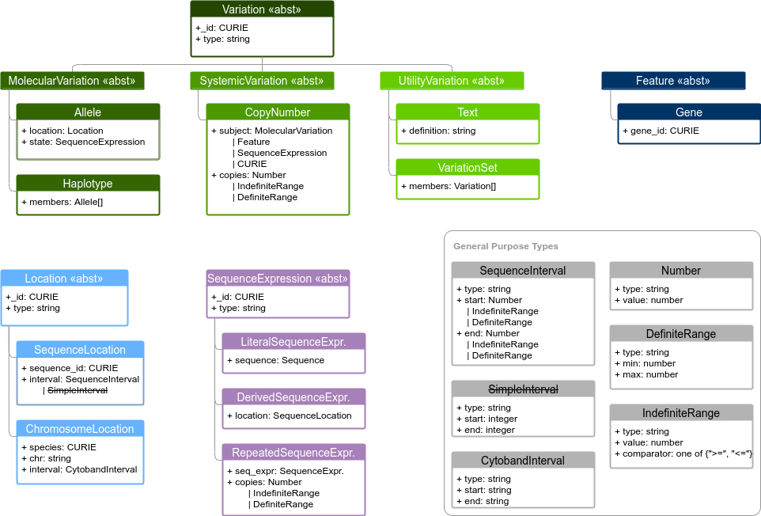

Figure Formatting Test
!!!!!!!!!!!!!!!!!!!!!!

Trying to get Figures and legends to format like they do in the VRS repo, e.g. `here <https://vrs.ga4gh.org/en/stable/schema.html>`_.

i copied content from that page below, and made a copy of the image in the va-spec docs//images folder.
But the figure is not rendering the same here. Maybe there is a config setting to change or something so
that this formatting can be applied in the va-spec docs?

-------------------  

.. _vr-schema-diagram:

   Current Variation Representation Specification Schema

   **Legend** The VRS information model consists of several interdependent
   data classes, including both concrete classes and abstract superclasses
   (indicated by <<abst>> stereotype in header). These classes may be broadly
   categorized as conceptual representations of Variation (green boxes),
   Feature (blue boxes), Location (light blue boxes), SequenceExpression
   (purple boxes), and General Purpose Types (gray boxes). The general purpose
   types support the primary classes, including intervals, ranges, Number and
   GA4GH Sequence strings (not shown). While all VRS objects are Value
   Objects, only some objects are intended to be identifiable (Variation,
   Location, and Sequence). Conceptual inheritance relationships between
   classes is indicated by connecting lines.  [`source
   <https://app.diagrams.net/#G1Qimkvi-Fnd1hhuixbd6aU4Se6zr5Nc1h>`__]

