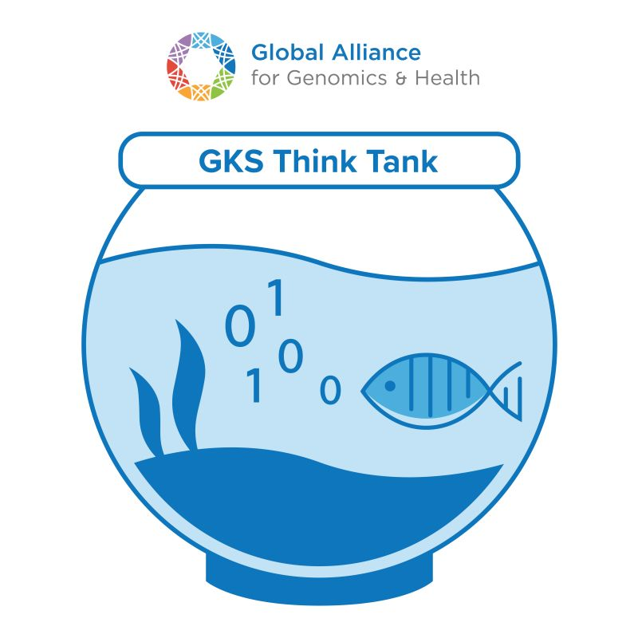

.. _getting-involved:

Getting Involved
@@@@@@@@@@@@@@@@

VA-Spec is driven by community involvement. This product is early in development, and we need your input and expertise to help make this as effective as possible. Here are a few ways that you
can get involved:

* `Join the group through GA4GH <https://www.ga4gh.org/get-involved/join-our-community/join/>`_ to receive regular updates on our progress.

* Join our monthly meetings. The schedule for upcoming meetings can be found `on the product website in GA4GH <https://www.ga4gh.org/product/variant-annotation/>`_.

    * Scroll to the bottom and click on "Meetings".

* Join the GA4GH VA Slack channel to connect with the community.

* Participate in the GA4GH Genomic Knowledge Standards (GKS) Work Stream Think Tank meetings, where VA-Spec issues and specification topics are often discussed. Information about GKS and participation opportunities is available on the `Genomic Knowledge Standards Work Stream page <https://www.ga4gh.org/work_stream/genomic-knowledge-standards/>`_.

* Read the machine readable schema definitions, participate in Discussions, and raise Issues in the `VA-Spec GitHub repository <https://github.com/ga4gh/va-spec>`_.

