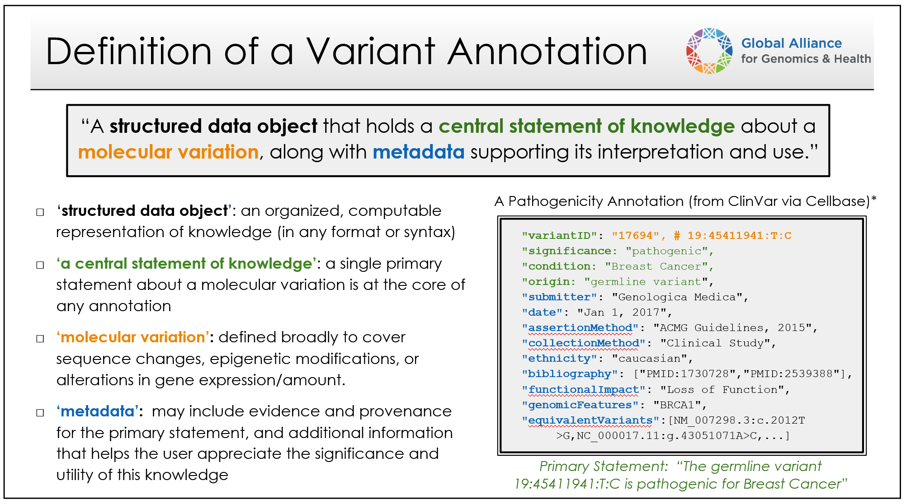

Introduction
!!!!!!!!!!!!

This document provides an high-level overview of VA-Spec components, modeling principles, development processes, and modes of use - with links to separate pages for additional details.

Overview
########

Variant Annotations are structured data object that holds a **central statement of knowledge** about a **molecular variation** (aka 'variant'), along with **evidence and provenance metadata** supporting its interpretation and use. These annotations may describe about a variant's pathogenicity, impact on gene function, population frequency, molecular consequence, or effect on response to treatment - and would ideally provide information about how this knowledge was generated. For more on definitions and scope, see `"What is a Variant Annotation?" <https://va-ga4gh.readthedocs.io/en/stable/faq.html#what-is-a-variant-annotation>`_, `"What types of variants are supported?" <https://va-ga4gh.readthedocs.io/en/stable/faq.html#what-types-of-variants-are-supported>`_, and `"What types of variant knowledge are supported?" <https://va-ga4gh.readthedocs.io/en/stable/faq.html#what-types-of-variant-knowledge-are-supported>`_ FAQs.

Reliable exchange of these and other types of Variant Annotations by clinicians, researchers, and testing laboratories is required to maximize the personal, public, research, and clinical value of genomic information.  The GA4GH Variant Annotation Specification (VA-Spec) was developed by a partnership among national information resource providers, major public initiatives, and diagnostic testing laboratories — as an open specification to standardize the exchange of such variation knowledge.

-------

Variant Annotations are structured data object that holds a **central statement of knowledge** about a **molecular variation** (aka 'variant'), along with **evidence and provenance metadata** supporting its interpretation and use (see `"What is a Variant Annotation?" <https://va-ga4gh.readthedocs.io/en/stable/faq.html#what-is-a-variant-annotation>`_). These annotations may describe diverse types of knowledge, including what is known about a variant's pathogenicity, impact on gene function, population frequency, molecular consequence, or effect on response to treatment. Reliable exchange of these and other types of variation knowledge by clinicians, researchers, and testing laboratories is required to maximize the personal, public, research, and clinical value of genomic information.  

The GA4GH Variant Annotation Specification (VA-Spec) was developed by a partnership among national information resource providers, major public initiatives, and diagnostic testing laboratories — as an open specification to standardize the exchange of such variation knowledge. 
 * It leverages the GA4GH `VRS <https://vrs.ga4gh.org/en/latest/index.html>`_ and `Cat-VRS <https://github.com/ga4gh/cat-vrs?tab=readme-ov-file>`_ specifications to represent diverse kinds of molecular variation as annotation subjects (see `"What types of variants are supported?" <https://va-ga4gh.readthedocs.io/en/stable/faq.html#what-types-of-variants-are-supported>`_).
 * It supports diverse kinds of biological and clinical variant knolwedge, leaving case-level variant inforamtion to other standards (see `"What types of variant knowledge are supported?" <https://va-ga4gh.readthedocs.io/en/stable/faq.html#what-types-of-variant-knowledge-are-supported>`_ ). 
 * It is built on the SEPIO Modeling Framework - leveraging this established methodology for defining provenance-focused standards, to define diverse VA Statement profiles as extensions of a Core Information Model (see `"What is the SEPIO Framework?" <https://va-ga4gh.readthedocs.io/en/stable/faq.html#what-is-the-sepio-framework>`_.

**The VA-Spec is comprised of the following components:**

#. `A Foundational Core Information Model <https://va-ga4gh.readthedocs.io/en/latest/core-information-model/index.html>`_: A domain-agnostic model for describing knowledge statements of any kind, and the evidence and provenance supporting them. This model, which is based on the SEPIO Framework, establishes a shared understanding of fundamental terms, concepts, and modeling patterns, and provides a foundation on which standard models for specific types of statements about molecular variation are built.  

#. `Standard VA Profiles <https://va-ga4gh.readthedocs.io/en/latest/standard-profiles/index.html>`_: A set of models built as 'Profiles' of the Core Information Model, which describe specific types of statements made about molecular variation (e.g. a `Variant Pathogenicity Statement <https://va-ga4gh.readthedocs.io/en/stable/standard-profiles/statement-profiles.html#variant-pathogenicity-statement>`_). These models are provided in machine-readable json schema, as shared standards for validation and exchange of data by the GA4GH community. 

#. `A Modeling Framework <https://va-ga4gh.readthedocs.io/en/latest/modeling-framework.html>`_:  A profiling methodology and tooling support to guide VA and external developers in executing the profiling process. This framework allows community adopters can build profiles for new statement types, or extend existing profiles - supporting an implementation-led approach that drives VA standards development.

#. `A Python Reference Implementation <https://va-ga4gh.readthedocs.io/en/stable/reference-implementation.html>`_:  Code libraries that demonstrate the creation, validation, and exchange of compliant data using GA4GH Profiles. These resources provide a working example of code that can be adopted and/or extended by adopters. ``COMING SOON``

This framework has allowed for implementation-driven development that reduces bottlenecks imposed by centralized approaches, leverages the expertise of diverse adopters, and delivers schema that have proven out in working applications.

The VA-Spec Standards Development Process
#########################################
The VA Modeling Framework allows for implementation-driven development that reduces bottlenecks imposed by centralized approaches, leverage the expertise of diverse adopters, and delivers schema that have proven out in working applications. **Figure 1** provides a summary level illustration of how Standard Statement Profiles are developed through this process - using a VAriant PAthogenicity Statement profile as an example. Details of the models and methodologies involved are provided in referenced documents, which can be further explored as desired.

1. Seeding the initial GKS Core Information Model . . . Initial version of the Core-IM represetns a subset of SEPIO model, selected based on requirements from an initial set of Statement and Statement models for active driver project implementations .

2. Buidling Profiles on the Core IM 

3. Expanding / Refining the Core Information Model to support implementation needs

Modeling Foundations
####################

Variant Representation
@@@@@@@@@@@@@@@@@@@@@@
To represent molecular variations that are subjects of VA Statements, the VA-Spec adopts two complementary GKS standards:

#. The `GA4GH Variant Representation Specification (VRS) <https://vrs.ga4gh.org/en/latest/index.html>`_, which provides JSON Schema for representing many classes of discrete genetic variation, and tools for generating globally-unique computed variant identifiers. VRS variants represent discrete instances of sequence variation in a specified context (reference, location, state) - e.g. the NM_005228.5(EGFR):c.2232_2250del(p.Lys745fs) variant `here <https://www.ncbi.nlm.nih.gov/clinvar/variation/177787/>`_. This includes single continuous alleles, haplotypes, genotypes, and copy number changes.

#. The `GA4GH Categorical Variation Representation Specification (Cat-VRS) <https://github.com/ga4gh/cat-vrs?tab=readme-ov-file>`_, which is built on top of VRS and provides a terminology and data model for describing 'categorical' variation concepts. Categorical variations are intensionally defined sets of variations, based on criteria that must be met for inclusion in a given category. Examples include `BRAF V600 mutations <https://civicdb.org/molecular-profiles/17/summary>`_ and `EGFR exon 19 deletions <https://civicdb.org/molecular-profiles/133/summary>`_. 

VRS and Cat-VRS models are directly imported for use in VA schema, and the VA-Spec reference implementation will incorporate VRS tools for identifier generation, normalization, and validation. See linked documentation above for more information about these specifications.  

VA Statement Representation
@@@@@@@@@@@@@@@@@@@@@@@@@@@

The **Core Information Model (Core-IM)** is a domain-agnostic model for representing statements of knowledge, and the foundation on which Statement-specific VA profiles are built. Below we provide an overview of the Core-IM **Class Hierarchy**, the **Statement Structures** these classes are used to construct, and features of the model that allow explicit representation of **Statement Semantics**. 

Core-IM Class Hierarchy
$$$$$$$$$$$$$$$$$$$$$$$
The initial version of the Core-IM was derived from the SEPIO Core Information Model, through selection of elements needed to support initial VA implementation use cases. A hierarchical view of this model is illustrated in **Figure 1**.

.. core-im-class-hierarchy:

.. figure:: images/core-im-class-hierarchy.PNG

**Legend** Figure 1: Hierarchical structure of classes and attributes comprising the domain-agnostic Core-IM. Note that a hierarchy of Domain Entity classes has been defined to represent things like Genes, Conditions, and Therapeutic Procedures, but is omitted here for space. See here for details. 

As VA implementations evolve and new VA profiles are created, more content from SEPIO will be added to support new requirements. The VA-Spec team has partnered with SEPIO developers to ensure coordinated evolution of these two standards.  For more information, see `"What is the SEPIO Framework?" <https://va-ga4gh.readthedocs.io/en/stable/faq.html#what-is-the-sepio-framework>`_, and `"How does the VA-Spec use SEPIO?"` <https://va-ga4gh.readthedocs.io/en/stable/faq.html#how-does-the-va-spec-use-the-sepio-framework>`_ FAQs.

Core-IM Statement Structure
$$$$$$$$$$$$$$$$$$$$$$$$$$$
The Core-IM supports Statement-centric approach, where each discrete assertion of knowledge is captured in a self-contained **Statement** object which roots a data structure like that in **Figure 2**. 

.. core-im-statement-data-structure:

.. figure:: images/core-im-statement-data-structure.PNG

**Legend** Figure 2: A class-level view of the 'associative' structure that VA Statements takes (as opposed to the 'hierarchical' structure of Core-IM class definitions that is depicted in **Figure 1**). Italicized text under class names illustrate the kind of information each class may report in the case of a Variant Pathogenicity Statement supported by Population Allele Frequency evidence.

In this structure, a Statement object roots a central axis, where it is linked to one or more **Evidence Lines** representing discrete arguments for or against it, and each Evidence Line may then be linked to one or more pieces of information used as evidence (i.e. **Evidence Items**) contributing to such an argument. Surrounding the axis are classes that describe the provenance of these core artifacts, including **Contributions** made to them by **Agents**, **Activities** performed in doing so, **Methods** that specify their creation, and **Documents** that describe them. This structure allows precise tracking of provenance information at the level of a Statement and each supporting Evidence Line and Item. A full data example illustrating the structure of a Variant Pathogenicity Statement can be found here (``TO DO``).

Core-IM Statement Semantics
$$$$$$$$$$$$$$$$$$$$$$$$$$$
Every Statement object in the Core-IM puts forth a **Proposition** - a possible fact it assesses or reports to be true. The semantics of this Proposition are explicitly captured using ``subject``, ``predicate``, and ``object`` attributes, and optional ``qualifier`` slot(s) (**Figure 3**). Additional ``direction`` and ``strength`` attributes can report whether the Statement reports the Proposition to be true or false, and the strength of evidence supporting this claim. 

.. core-im-statement-semantics:

.. figure:: images/core-im-statement-semantics.PNG

**Legend** Figure 3: Explicit Statement Semantics are supported by the Core-IM. (a) Model: the Statement model for a Variant Pathogenicity Profile, showing only attributes used to represent the semantics of what a statement reports to be true. (b) Data: a json data example of a Variant Pathogenicity Statement instance, noting elements holding the Statement's proposition and those assessing it's strength and direction. (c) Semantics: the  plain-language meaning of what the statement data structure reports to be true. 

This basic model supports two "modes of use" for Statements: an 'Assertion Mode' which support simple assertions of knowledge, and a 'Proposition Assessment Mode' allowing nuanced representations of the state of evidence surrounding a possible fact. Implementations can choose the mode that best fits their data. Details are provided in the ``Statement`` class page `here <https://va-ga4gh.readthedocs.io/en/latest/core-information-model/entities/information-entities/statement.html#implementation-guidance>`_. 

Standard Statement Profiles
###########################

1. Layer Cake Figure
2. Hierarchical view of the Var Path Profile Subset
3. Data Structure View of the VarPath Statement Model
    a. List examples of specializations implemented via profiling . . . 
    b. Reference Profiling Methodology Guide

.. note::  **Study Result Profiles**: While the majority of applications are focused on creating **Statement** profiles, the modeling framework supports profiling of other Core-IM classes, including **Study Results** and **Evidence Lines**. For example, the `CohortAlleleFrequencyStudyResult <https://va-ga4gh.readthedocs.io/en/latest/standard-profiles/study-result-profiles.html#cohort-allele-frequency-study-result>`_ profile specializes the StudyResult class to represent select data from statistical analyses of allele frequencies in different human populations along with methodological and quality metadata. More information on these types of profiles can be found `here <https://va-ga4gh.readthedocs.io/en/latest/modeling-framework.html#profiling-methodology>`_.

**Attic:**

This basic model supports two "modes of use" for Statements, which allow for simple assertions of knowledge, or nuanced representations of the state of evidence surrounding a given Proposition. Implementations can choose the mode that best fits their data. Details are provided in the ``Statement`` class page `here <https://va-ga4gh.readthedocs.io/en/latest/core-information-model/entities/information-entities/statement.html#implementation-guidance>`_. 

Cat-VRS tools will facilitate mapping of such categorical concepts onto sets of discrete variant instances in the real world. For example, `NM_005228.5(EGFR):c.2232_2250del(p.Lys745fs) <https://www.ncbi.nlm.nih.gov/clinvar/variation/177787/>`_ is a discrete variant that matches the "EGFR exon 19 deletions" categorical variant definition.

