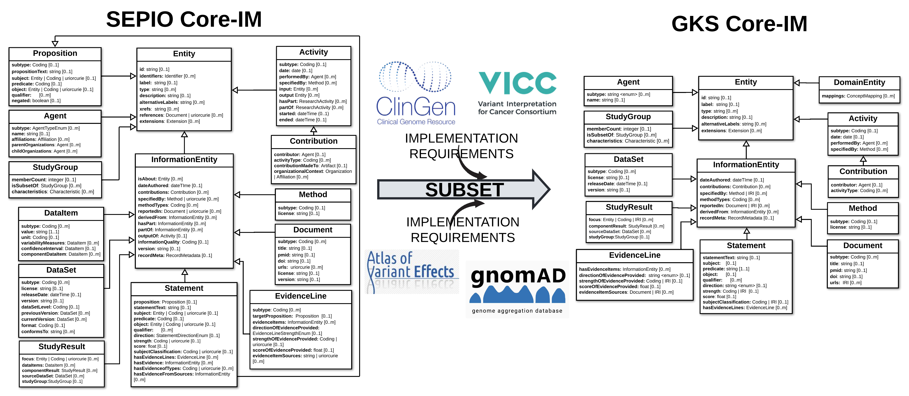

Introduction
!!!!!!!!!!!!

``PREREQUISITES``: None

Reliable exchange of knowledge about molecular variation between clinicians, researchers, and testing laboratories is required to maximize the personal, public, research, and clinical value of genomic information. This knowledge is typically exchanged as `Variant Annotations <https://va-ga4gh.readthedocs.io/en/latest/faq.html#what-is-a-variant-annotation>`_ - structured data objects that holds a **central statement of knowledge** about a **molecular variation**, along with **evidence and provenance metadata** supporting its interpretation and use. 

The **GA4GH Variant Annotation Specification (VA-Spec)** was developed by a partnership among national information resource providers and major public initiatives — as an open specification to standardize the exchange of such variation knowledge. It was built as a `SEPIO-based modeling framework <https://va-ga4gh.readthedocs.io/en/latest/faq.html#what-is-the-sepio-framework>`_ that supports implementation-driven development of standard models for specific VA Statement types. It leverages the GA4GH `VRS <https://vrs.ga4gh.org/en/latest/index.html>`_ and `Cat-VRS <https://github.com/ga4gh/cat-vrs?tab=readme-ov-file>`_ specifications to represent `diverse kinds of molecular variation <https://va-ga4gh.readthedocs.io/en/latest/faq.html#what-types-of-variants-are-supported>`_ as annotation subjects. And it supports `diverse kinds of biological and clinical variant knolwedge <https://va-ga4gh.readthedocs.io/en/latest/faq.html#what-kinds-of-variant-knowledge-are-supported>`_, leaving case-level variant information to other standards. 

VA Framework Components
#######################

The VA-Spec modeling framework is comprised of the following components:

#. `A Foundational 'GKS Core Information Model' <https://va-ga4gh.readthedocs.io/en/latest/core-information-model/index.html>`_: A domain-agnostic model for describing knowledge statements of any kind, and the evidence and provenance supporting them. This model, which is based on the SEPIO Core-IM, establishes a shared understanding of fundamental terms, concepts, and modeling patterns - and provides a foundation on which standard models for specific types of statements about molecular variation are built.  

#. `Standard VA Profiles <https://va-ga4gh.readthedocs.io/en/latest/standard-profiles/index.html>`_: A set of models built as 'Profiles' of the Statement or Study Result classes in the Core Information Model, to support specific types of knolwedge about molecular variation (e.g. a `Variant Pathogenicity Statement <https://va-ga4gh.readthedocs.io/en/latest/standard-profiles/statement-profiles.html#variant-pathogenicity-statement>`_) profile. These models are provided in machine-readable json schema, as shared standards for validation and exchange of data by the GA4GH community. 

#. `A Profiling Methodology <https://va-ga4gh.readthedocs.io/en/latest/modeling-framework.html>`_:  A formal method and tooling support to guide internal and external developers in executing the profiling process. This approach allows community adopters to  build profiles for new statement types, or extend existing profiles - supporting an implementation-led approach that drives VA standards development.

#. `A Python Reference Implementation <https://va-ga4gh.readthedocs.io/en/latest/reference-implementation.html>`_:  Code libraries that demonstrate the creation, validation, and exchange of compliant data using GA4GH Profiles. These resources provide a working example of code that can be adopted and/or extended by adopters. ``COMING SOON``

This framework has allowed for implementation-driven development that reduces bottlenecks imposed by centralized approaches, leverages the expertise of diverse adopters, and delivers schema that have proven out in working applications.

VA Standard Development and Dependencies
########################################
While development of `VA Standard Profiles <https://va-ga4gh.readthedocs.io/en/stable/standard-profiles/index.html>`_ is grounded in foundational SEPIO and GKS Core IM standards, it is ultimately driven by bottom-up implementation requirements. Accordingly, development tasks unfold across a stack of interdependent models and specifications. It is important to understand this hierarchy of models and their dependencies before beginning to use or contribute to the VA-Spec. 

.. _va-model-layers:

.. figure:: images/va-model-layers.png

   VA Ecosystem Models and Dependencies

   **Legend**  Models in the VA-Spec ecosystem that support generation of the VA Standard Profile Schema representing the final product of the VA-Specification.  Arrows on the left describe processes through which downstream models are generated from more foundational ones. Arrows on the right describe the propagation of requirements from implementation models to inform upstream Core-IM expansion and refinement. The format of each model (e.g. 'YAML', 'JSON') is indicated by icons at the left of each.

* The **SEPIO Core-IM** provides foundational representation of domain-agnostic concepts describing the knowledge generation process, and artifacts it produces, and relationships between them. It is part of a larger modeling Framework that includes a Profiling Methodology for deriving models specialized for particular types of Statements reporting variant knowledge, or Study Results reporting created sets of variant data. It is written in a yaml format and not formalized as a json schema, as it is not intended to be directly implemented in data. 

* The **GKS Core-IM** is the basis for the profiling process that generates Statement or Study Result profiles for specific types of variant annotations.. It is **extracted** as a hand-selected subset of the SEPIO Core-IM, chosen specifically to support profiles drafted by early Driver Project implementations of the VA-Spec.

* **GKS Domain Entity Models** represent the biological and clinical entities that Variant Annotations are about, and  serve as subjects, objects, and qualifiers of VA Statements (Genes, Conditions, Therapeutic Procedures). These classes **extend** the GKS Core-IM to support VA Profile definitions. 

* **VA Standard Profile IMs** define the structure and semantics of the Standard Models that will be used by the GA4GH community. Separate yaml-based are defined for different kinds of VA Statements and Study Results. Profile definition is implementation-driven, beginning Draft Implementation Profiles which **select** and **specialize** elements from the GKS Core-IM with profile-specific constraints, based on the needs of a particular application. 

* **VA Standard Profile JSON Schema** are the final product of the VA modeling framework, intended for implementation in working data systems.  They are **formalized** transformations of the yaml-based Standard Profiles, generated automatically by Metaschema Processor tools. 

* **Implementation Schema** are concrete schema that are actually implemented in data systems. When Driver Projects **implement**  a Standard JSON schema, they may use it as is, translate it into different schema languages (eg. graphql, ShEX), and/or refine it with application-specific additions to support local implementation needs. 

While the SEPIO and GKS Core models are the basis for deriving downstream Standard Profiles, the evolution of these foundational core models is driven by bottom-up requirements arising from implementation models for working data applications. These requirements flow upstream to inform extension or refinement of the GKS Core-IM, and ultimately the SEPIO Core-IM - ensuring tight alignment across these models, and adherence to core modeling principles they espouse. 

Emergence and Evolution of VA Standards
###############################################
As noted, VA Standard development is implementation driven, beginning with the definition of a Draft Implementation Profile to meet the needs of a particular driver project application. Emergence f a consensus standard requires negotiation across developers of SEPIO, VA, and Implementation models, through the following processes:

**Align and Refine Models**
While aspiring to use the SEPIO and GKS Core IMs, these draft implementation models may include features that are not consistent with these foundational models. Once an initial implementation profile is drafted,  implementers work with the VA Team to identify such inconsistencies, and refine data models to bring them into alignment. This may involve reworking the draft implementation profile to more fully adopt Core-IM modeling patterns, or adding new features to these standard models to support requirements surfaced by the implementation profile. Any implementation-specific features not ultimately supported by the GKS Core-IM can be captured in a compliant way by using the `Extension <https://va-ga4gh.readthedocs.io/en/latest/core-information-model/data-types.html#extension>`_ element.

**Publish as a GA4GH Standard Profile**
Once alignment is complete, a draft of the 'Standard' Profile is ready circulated for community review.  Concerns and feedback are discussed and resolved, and any final changes have been propagated to the relevant models. The profile is then published as an official VA Standard Profile for that particular Statement or Study Result type.

**Evolve Profile to Support New Requirements**
Standard Profiles will evolve as existing implementations expand coverage of the initial draft, or additional implementations provide new requirements to cover their knowledge sources. e.g. the Variant Pathogenicity Profile will evolve as ClinGen expands the ClinVar data it needs the profile to cover, and other Driver Projects such AGHA/Shariant adopt the standard and need it to support their implementations. 

Implementing the VA-Spec
########################

The VA Modeling Framework offers many modes for engaging with the VA-Specification. Some users will want to **adopt established standard profiles out-of-the-box**, others may want to **extend or refine an existing standard profile** for their use case, while others may want to **develop profiles for entirely new types of Statements**. The Quick Start Guide provides more information on these modes of use, and a decision tree to help adopters identify their best entry point into the VA Framework.

The `Quick Start Guide <https://va-ga4gh.readthedocs.io/en/latest/quick-start.html>`_ provides more information on these **modes of use**, and a **decision tree** to help adopters identify their best entry point into the VA Framework.

And this `Profiling Methodology guide <https://va-ga4gh.readthedocs.io/en/latest/profiling-methodology.html>`_  explains specific tasks and conventions involved in buidling VA Profiles.  

--------------------

**Attic:**

---------

VA Standards Development and Adoption
#####################################
While development of VA Standard Profiles is grounded in standard foundational SEPIO and GKS Core IM standards, it is ultimately driven by bottom-up implementation requirements. Accordingly, development tasks unfold across a stack of interdependent models and specifications. 

The series of figures below provides a high-level overview of the implementation-driven processes through which VA Standard Profiles are created and matured into standards - starting with definition of the foundational GKS Core-IM. A Variant Pathogenicity Statement Profile is used as an example, but the process described applied generally to any Standard Profile development task.

**GKS Core-IM extracted from the SEPIO Information Model**

The initial version of the GKS Core-IM represents a subset of SEPIO model, with elements selected based on the needs of early adopter VA-Spec implementations, including a ClinGen/VICC Variant Pathogenicity Statement Profile to support ClinVar data. As these inital profiles expand to support more data, or profiles for new statement types are developed, additional elements can be pulled into the GKS Core-IM form the SEPIO model to support them. 

**Draft Implementation Profiles Specialize the GKS Core-IM**
A draft Profile is started when an implementation . . . 
A Draft Implementation Profile is created by selecting elements from the GKS Core-IM and then specialized with statement and application-specific constraints - based on the needs of active implementations. In this case, classes and attributes are sleected and specialized to represent ClinVar Variant Pathogenicity statements. These **Draft Implementation Profiles** stick to the Core-IM model where possible, but may add new features where this model does not support source data or requirements. 

**Align and Refine Models**
Draft implementation models may include features that are not consistent with or included in the foundational GKS and SEPIO Core Models. Implementers work with the VA Team to identify such cases, and refine models to bring them into alignment. This may involve refining the draft implementation model to use GKS or SEPIO modeling patterns, or adding new features to these standard models to support new requirements surfaced by the implementation. This process requries negotioan across developers of SEPIO, VA, and Implementation models. Any implementation-specific features not ultimately supported by the GKS Core-IM can be captured in a compliant way by using the `Extension <https://va-ga4gh.readthedocs.io/en/latest/core-information-model/data-types.html#extension>`_ element.

**Publish as a GA4GH Standard Profile**
Once all models are aligned, the draft is circulated for community review.  After concernes and feedback are addressed, it is published as an official VA Standard Profile for the Statement type. 

**Evolve Profile to Support New Requirements**
Standard Profiles will evolve as existing implementations expand coverage of the initial draft, or additional implementations provide new requirements to cover their knowledge sources. e.g. the Variant Pathogeniity Profile will evolve as ClinGen expands the ClinVar data it needs the profile to cover, and other Driver Projects such AGHA/Shariant adopt the standard and need it to support their implementations. 

The activities described above unfold across a stack of interdependent models and specifications. The `Quick Start Guide <https://va-ga4gh.readthedocs.io/en/latest/quick-start.html>`_ provides a more detailed overview of this ecosystem, and how to engage with it. And this `Profiling Methodology overview <https://va-ga4gh.readthedocs.io/en/latest/profiling-methodology.html>`_  explains specific tasks and conventions involved in buidling VA Profiles. Finally, See the `Modeling Foundations document <>`_ to understand model general patterns and principles employed by the VA Standards, and the `Core Information Model <>`_ index of Class definitions for a deep dive into the data supported by each.

.. note::  **Statement vs Study Result Profiles**: While the majority of applications of the VA-Spec deal in knowledge statements, and use **Statement** Profiles, the modeling framework supports        profiling of other Core-IM classes such as **Study Result**. This is done when the information captured represents data items a study or dataset pertaining to some variant of interest, as           opposed to a broader statement of knowledge (e.g, one that may be concluded from interpretation of such data). For example, the `CohortAlleleFrequencyStudyResult <https://va-ga4gh.readthedocs.io/en/latest/standard-profiles/study-result-profiles.html#cohort-allele-frequency-study-result>`_ profile specializes the StudyResult class to represent select data from statistical analyses of allele frequencies in different human populations along with methodological and quality metadata. More information on these types of profiles can be found `here <https://va-ga4gh.readthedocs.io/en/latest/modeling-framework.html#profiling-methodology>`_.

---------

`VA Standard Profile schema <https://github.com/ga4gh/va-spec/tree/1.x/schema/profiles/json>`_ represent the final output of modeling efforts that unfold across a stack of dependent models and specifications (**Figure 1**). It is important to understand this hierarchy of models and their dependencies before beginning to use or contribute to the VA-Spec. 

.. note::  **Additional Reading**:  (1) `"What is a Variant Annotation?" <https://va-ga4gh.readthedocs.io/en/latest/faq.html#what-is-a-variant-annotation>`_, (2) `"What is SEPIO?" <https://va-ga4gh.readthedocs.io/en/latest/faq.html#what-is-the-sepio-framework>`_ FAQ, (3) `"What types of variants are supported?" <https://va-ga4gh.readthedocs.io/en/latest/faq.html#what-types-of-variants-are-supported>`_ FAQ, (4) `"What types of variant knowledge are supported?" <https://va-ga4gh.readthedocs.io/en/latest/faq.html#what-kinds-of-variant-knowledge-are-supported>`_ FAQ.
**The VA-Spec Modeling framework is comprised of the following components:**

The **GA4GH Variant Annotation Specification (VA-Spec)** was developed by a partnership among national information resource providers and major public initiatives — as an open specification to standardize the exchange of such variation knowledge. It was built as a SEPIO-based modeling framework that supports implementation-driven development of standard models for specific VA Statement types (see `"What is SEPIO?" <https://va-ga4gh.readthedocs.io/en/latest/faq.html#what-is-the-sepio-framework>`_). It leverages the GA4GH `VRS <https://vrs.ga4gh.org/en/latest/index.html>`_ and `Cat-VRS <https://github.com/ga4gh/cat-vrs?tab=readme-ov-file>`_ specifications to represent diverse kinds of molecular variation as annotation subjects (see `"What types of variants are supported?" <https://va-ga4gh.readthedocs.io/en/latest/faq.html#what-types-of-variants-are-supported>`_). And it supports diverse kinds of biological and clinical variant knolwedge, leaving case-level variant information to other standards (see `"What types of variant knowledge are supported?" <https://va-ga4gh.readthedocs.io/en/latest/faq.html#what-kinds-of-variant-knowledge-are-supported>`_). 

The **GA4GH Variant Annotation Specification (VA-Spec)** was developed by a partnership among national information resource providers and major public initiatives — as an open specification to standardize the exchange of such variation knowledge. It leverages the GA4GH `VRS <https://vrs.ga4gh.org/en/latest/index.html>`_ and `Cat-VRS <https://github.com/ga4gh/cat-vrs?tab=readme-ov-file>`_ specifications to represent diverse kinds of molecular variation as annotation subjects (see `"What types of variants are supported?" <https://va-ga4gh.readthedocs.io/en/latest/faq.html#what-types-of-variants-are-supported>`_). It supports diverse kinds of biological and clinical variant knolwedge, leaving case-level variant inforamtion to other standards (see `"What types of variant knowledge are supported?" <https://va-ga4gh.readthedocs.io/en/latest/faq.html#what-kinds-of-variant-knowledge-are-supported>`_ ). 

The VA-Spec is built as a **SEPIO-based modeling framework** that supports implementation-driven development of standard models for specific VA Statement types (see `"What is SEPIO?" <https://va-ga4gh.readthedocs.io/en/latest/faq.html#what-is-the-sepio-framework>`_).  The framework is comprised of the following components:

The VA-Spec is built on the SEPIO Modeling Framework - leveraging this established methodology for defining provenance-focused standards, to define diverse VA Statement profiles as extensions of a Core Information Model (see `"What is the SEPIO Framework?" <https://va-ga4gh.readthedocs.io/en/latest/faq.html#what-is-the-sepio-framework>`_.

And it is built as an extension of the SEPIO Modeling Framework - leveraging this established model and profiling methodology for defining provenance-focused standards, to define diverse VA Statement profiles as extensions of a Core Information Model (see `"What is SEPIO?" <https://va-ga4gh.readthedocs.io/en/latest/faq.html#what-is-the-sepio-framework>`_.

The series of figures below provides a high-level overview of the processes through which VA models are generated, from the creation and evolution of the foundational Core-IM, to derivation of Statement profiles from the Core-IM, to the maturation of draft profiles into established standards, and the adoption and iterative refinement of these standards.

This basic model supports two "modes of use" for Statements, which allow for simple assertions of knowledge, or nuanced representations of the state of evidence surrounding a given Proposition. Implementations can choose the mode that best fits their data. Details are provided in the ``Statement`` class page `here <https://va-ga4gh.readthedocs.io/en/latest/core-information-model/entities/information-entities/statement.html#implementation-guidance>`_. 

.. image:: images/annotation-definition.PNG
  :width: 700

Cat-VRS tools will facilitate mapping of such categorical concepts onto sets of discrete variant instances in the real world. For example, `NM_005228.5(EGFR):c.2232_2250del(p.Lys745fs) <https://www.ncbi.nlm.nih.gov/clinvar/variation/177787/>`_ is a discrete variant that matches the "EGFR exon 19 deletions" categorical variant definition.

 Additional details about the models and methodologies involved are provided in referenced documents for further exploration.

 Additional details about the models and methodologies involved are provided in referenced documents for further exploration.
