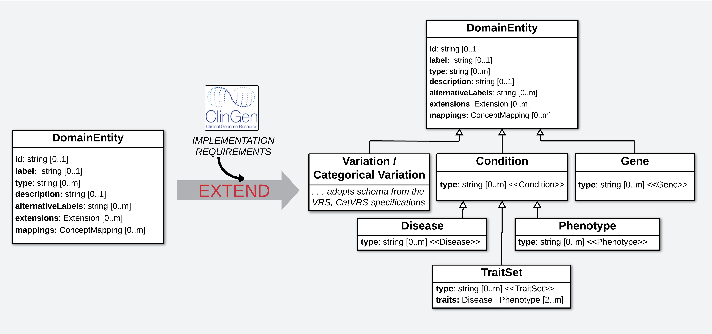

.. _introduction:

Introduction
!!!!!!!!!!!!

``PREREQUISITES``: None

The **GA4GH Variant Annotation Specification (VA-Spec)** was developed by a partnership among national information resource providers and major public initiatives — as an open specification to standardize the exchange of knowledge in :ref:`Variant Annotations<what-is-a-variant-annotation>`. It provides a set of **Standard Models** for exchanging specific kinds of **Statements** and **Study Results** about genetic variation, and a **Modeling Framework** supporting community-driven development of these standards as **Profiles** of a foundational **Core Information Model**. It leverages the GA4GH `VRS <https://vrs.ga4gh.org/en/latest/index.html>`_ and `Cat-VRS <https://github.com/ga4gh/cat-vrs?tab=readme-ov-file>`_ specifications to represent :ref:`diverse kinds of variation<what-types-of-variants-are-supported>` as annotation subjects. And it supports :ref:`diverse kinds of variant knowledge<what-kinds-of-variant-knowledge-are-supported>`, leaving case-level variant information to other standards. 

The GA4GH Variant Annotation Specification (VA-Spec) was developed by a partnership among national information resource providers and major public initiatives — as an open specification to standardize the exchange of knowledge in :ref:`Variant Annotations<what-is-a-variant-annotation>`. It provides a set of :ref:`Standard Models<standard-profiles>` for exchanging specific kinds of :ref:`Statements<Statement>` and :ref:`Study Results<StudyResult>` about genetic variation, and a :ref:`Modeling Framework<<profiling-methodology>` supporting community-driven development of these standards as Profiles of a foundational :ref:`Core Information Model<core-information-model>`. It leverages the GA4GH `VRS <https://vrs.ga4gh.org/en/latest/index.html>`_ and `Cat-VRS <https://github.com/ga4gh/cat-vrs?tab=readme-ov-file>`_ specifications to represent :ref:`diverse kinds of variation<what-types-of-variants-are-supported>` as annotation subjects. And it supports :ref:`diverse kinds of variant knowledge<what-kinds-of-variant-knowledge-are-supported>`, leaving case-level variant information to other standards. 

VA Framework Components
#######################

The VA-Spec provides a :ref:`SEPIO-based Modeling Framework<what-is-the-sepio-framework>` that includes the following components:

#. :ref:`A Foundational Core Information Model (Core-IM) <core-im>`: A domain-agnostic model for describing knowledge statements of any kind, and the evidence and provenance supporting them. This 'GKS Core-IM', which is based on the SEPIO Information Model, establishes a shared understanding of fundamental terms, concepts, and modeling patterns - and provides a foundation on which 'Standard VA Profiles' are built.  

#. :ref:`Standard VA Profiles <standard-profiles>`: A set of models built as 'Profiles' of the Core-IM Statement or Study Result classes, each supporting a specific types of knowledge about molecular variation (e.g. a :ref:`Variant Pathogenicity Statement <variant-pathogenicity-statement>`) Profile. These models are provided as machine-readable json schema, as shared standards for validation and exchange of data by the GA4GH community. 

#. :ref:`A Profiling Methodology <profiling-methodology>`:  A set of defined processes, conventions, and tooling support to guide VA and community developers in executing the Profiling process. This approach allows adopters to  build profiles for new statement types, or extend existing profiles for their data or use case - supporting a distributed approach to VA standards development.

#. :ref:`A Python Reference Implementation <reference-implementation>`:  Code libraries that demonstrate the creation, validation, and exchange of compliant data using GA4GH Profiles. These resources provide a working example of code that can be adopted and/or extended by adopters. ``COMING SOON``

This modeling framework has allowed for distributed, implementation-driven development that reduces bottlenecks imposed by centralized approaches, leverages the expertise of diverse adopters, and produces standards that have been proven out in working applications.

.. _va-standard-development-and-dependencies:

VA Standard Development and Dependencies
########################################
While development of :ref:`VA Standard Profiles <standard-profiles>` is grounded in foundational SEPIO and GKS core models, it is ultimately driven by bottom-up implementation requirements. Accordingly, development tasks unfold across a stack of interdependent models and specifications, as described below. 

.. _va-model-dependencies:

.. figure:: images/va-model-dependencies.png

   VA Ecosystem Models and Dependencies

   **Legend** A hierarchy of models support generation of the Standard Profile Schema that are the final product of the VA-Specification. Arrows on the left describe PROCESSES through which downstream models are generated from more foundational ones. Arrows on the right describe the propagation of requirements from implementation models to INFORM upstream Core-IM expansion and refinement. The format of each model (e.g. 'YAML', 'JSON') is indicated by icons on each.

Below we describe each model in this ecosystem and how it is developed, using **ClinGen's** definition of a **Variant Pathogenicity Statement Profile** to support ClinVar SCV data as an illustrative example. 

**1. The SEPIO Core-IM** provides foundational representation of domain-agnostic concepts describing the knowledge generation process, and artifacts it produces, and relationships between them. It is part of a larger modeling Framework that includes a Profiling Methodology for deriving models specialized for particular types of Statements reporting variant *knowledge*, or Study Results reporting created *related collections of variant data*. It is written in a yaml format and not formalized as a json schema, as it is not intended to be directly implemented in data. More information can be found :ref:`here <what-is-the-sepio-framework>`. 

**2. The GKS Core-IM** is the basis for the VA Profiling process that generates Statement and Study Result Profiles for specific types of annotations. The VA Team ``EXTRACTED`` a hand-selected subset of the SEPIO model for inclusion in the GKS Core-IM, which were chosen specifically to support **Draft Implementation Profiles** created by early adopters of the VA-Spec (including ClinGen's Pathogenicity Statement profile).

.. _core-im-from-sepio:

.. figure:: images/core-im-from-sepio.png

   Extraction of the Core-IM from the SEPIO Model

   **Legend** Classes and attributes needed for ClinGen's Variant Pathogenicity Profile are identified and extracted into the GKS Core-IM subset (which will include additional elements needed to support other implementation profiles being created by other Driver Projects such as VICC and MAVEdb)

**3. GKS Domain Entity Models** represent the biological and clinical entities that Variant Annotations are about, and serve as subjects, objects, and qualifiers of VA Statements (Genes, Conditions, Therapeutic Procedures). Conceptually, these classes ``EXTEND`` the GKS Core-IM to support VA Profile definitions. These live in the `GKS-Commons repository <https://github.com/ga4gh/gks-common/blob/1.x/schema/domain-entities/domain-entities-source.yaml>`_ where they are available for broader re-use in other Profiles as specifications. 

.. _domain-entities-from-core-im:

   Extension of Core-IM with Domain Entity Classes

   **Legend** The **Variant Pathogenicity Profile** requires representations of **Variations** that serve as the subjects of these statements, **Conditions** that serve as the objects, and **Genes** which may provide qualifying context.  For Variations, we adopt the `GA4GH VRS specification <https://vrs.ga4gh.org/en/latest/index.html>`_. For Conditions and Genes, we drafted minimal starter models as Domain Entity subclasses, which will evolve as more use cases and profiles emerge. 

**4. VA Standard Profile IMs** define the structure and semantics of the Standard models that will be used by the GA4GH community. Separate yaml-based profiles are defined for different kinds of VA Statements and Study Results. Development is implementation-driven, beginning with Draft Implementation Profiles which ``SPECIALIZE`` selected elements from the GKS Core-IM, based on the needs of a particular application. 

.. _standard-profile-from-core-im:

.. figure:: images/standard-profile-from-core-im.png

   Profiling of the Core-IM into a Draft Variant Pathogenicity Statement Profile

   **Legend** A draft of a Variant Pathogenicity Statement Profile is created through the profiling process whereby elements needed to support the ClinVar data and ClinGen's implementation requirements. GKS Core_IM elements used in the profile are highlighted in BLUE. Examples of specializations are shown in RED in the zoomed Variant Pathogenicity Statement class, including definition of this Statement subclass itself, binding of *subject* and *object* attributes to specific Domain Entity classes, definition of a specific *qualifier* class to capture gene context, and definition and binding of the *predicate* attribute to a specific enumeration of permissible values. 

**Importantly**, a final VA Standard Profile is not established until the VA Team works with implementers and standards developers to align initial implementation models with foundational core models and principles (see :ref:`below <establishing-and-evolving-va-standard>`).

**5. VA Standard Profile JSON Schema** are the final, machine readable products of the VA modeling framework, intended for implementation in working data systems.  They ``FORMALIZE`` the yaml-based Profile definitions, through automated transformation to JSON schema by `GKS Metaschema Processor <https://github.com/ga4gh/gks-metaschema>`_ tools. 

.. _schema-from-yaml-profile:

   Formalization of YAML Source profiles into JSON Schema specifications 

   **Legend** A JSON Schema specification of the Standard Variant Pathogenicity Statement Profile are automatically derived from source YAML by the GKS Metaschema Processor

**6. Implementation Schema** are concrete schema that are actually implemented in data systems. When Driver Projects ``IMPLEMENT`` a VA Standard JSON schema, they may use it as is, translate it into different schema languages (eg. GraphQL, ShEX), and/or refine it with application-specific content to support implementation needs. Such local changes break from the VA Standard, which requires data to be transformed back to compliant form for sharing over GA4GH APIs.

.. _implementation-from-standard-profile:

.. figure:: images/implementation-from-standard-profile.png

   Implementation of Standard JSON Schema by ClinGen, with System-Specific Changes

   **Legend** ClinGen systems may translate the standard **JSON schema** into a **GraphQL** specification, and make a handful of application-specific changes (red) to meet local system requirements (e.g. flattening classes and adding a few new custom properties).

While the SEPIO and GKS Core models are the basis for deriving Standard Profiles, the evolution of these foundational core models is driven by bottom-up requirements arising from implementation models for working data applications. These requirements flow upstream to inform extension or refinement of the GKS Core-IM, and ultimately the SEPIO Core-IM - ensuring tight alignment across these models, and adherence to core principles they espouse. 

.. _establishing-and-evolving-va-standard:

Establishing and Evolving VA Standards
######################################
As noted, VA Standard development begins with the definition of a **Draft Implementation Profile** to meet the needs of a particular driver project application. Emergence of a consensus Standard Profile requires negotiation across developers of SEPIO, VA, and Implementation models, through the following processes:

**1. Align and Refine Models:**
While aspiring to use the SEPIO and GKS Core IMs were possible, Draft Implementation Models may include features that are not consistent with these foundational models. Once an initial implementation profile is drafted, implementers work with the VA Team to identify such inconsistencies, and refine data models to bring them into alignment. This may involve reworking the implementation model to more fully adopt Core-IM modeling patterns, or adding new features to core models to support requirements surfaced by the implementation. Notably, any implementation-specific features not ultimately supported by the GKS Core-IM or Standard Profile can be captured in application data using the :ref:`Extension <Extension>` element.

**2. Publish as a GA4GH Standard Profile:**
Once alignment is complete, a draft of the Standard Profile is circulated for community review. Concerns and feedback are discussed and resolved, and any final changes are propagated to the relevant models. The model is implemented and tested in working systems, followed by possible rounds of review and iteration.  Once stable, it is released as an official VA Standard Profile for a particular Statement or Study Result type. This is  typically reflected in the maturity level of the Profiled Statement or Study Result class being raised to 'Trial Use' - to indicate its adoption by two or more implementations. 

**3. Evolve Profile to Support New Requirements:**
A given Standard Profile will evolve as existing implementations expand coverage to new data types, and as new implementations provide novel requirements to support their use case. For example, the Variant Pathogenicity Statement Profile will evolve as ClinGen expands the ClinVar data it wants the Profile to cover, and as other Driver Projects such AGHA/Shariant adopt the Standard and need it to support their implementation. Evolving a Standard through refinement or addition of content will proceed through a similar community-driven and implementation-tested process.

Implementing the VA-Spec
########################

The VA Modeling Framework offers many modes for engaging with the VA-Specification. Some users will want to **adopt established standard profiles out-of-the-box**, others may want to **extend or refine an existing standard profile** for their use case, while others may want to **develop entirely new profiles for additional types of Statements**.

The Quick Start Guide provides more information on these **modes of use**, and a **decision tree** to help adopters identify their best entry point into the VA Framework. And the :ref:`Profiling Methodology <profiling-methodology>` explains in detail the specific tasks and conventions involved in building VA Profiles.
