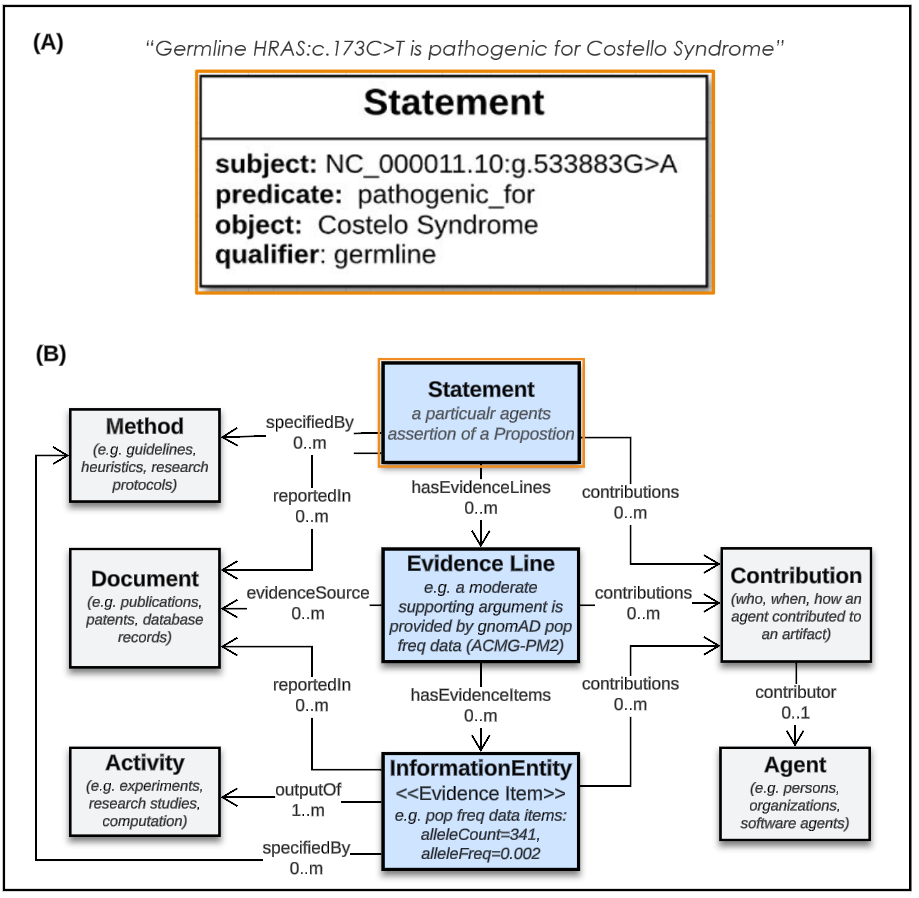

Introduction
!!!!!!!!!!!!

This document provides an high-level overview of VA-Spec components, modeling principles, development processes, and modes of use - with links to separate pages for additional details.

Overview
########

Variant Annotations are structured data object that holds a central statement of knowledge about a molecular variation (aka 'variant'), along with evidence and provenance metadata supporting its interpretation and use. For example, a given annotation may report knowledge about a variant's pathogenicity, impact on gene function, population frequency, molecular consequence, or effect on response to treatment - and provide evidence and provenance information supporting this knowledge. For detailed definition and scope information, see  
`"What is a Variant Annotation?" <https://va-ga4gh.readthedocs.io/en/stable/faq.html#what-is-a-variant-annotation>`_, `"What types of variants are supported?" <https://va-ga4gh.readthedocs.io/en/stable/faq.html#what-types-of-variants-are-supported>`_, and `"What types of variant knowledge are supported?" <https://va-ga4gh.readthedocs.io/en/stable/faq.html#what-types-of-variant-knowledge-are-supported>`_ FAQs.

Reliable exchange of these and other types of Variant Annotations by clinicians, researchers, and testing laboratories is required to maximize the personal, public, research, and clinical value of genomic information.  The GA4GH Variant Annotation Specification (VA-Spec) was developed by a partnership among national information resource providers, major public initiatives, and diagnostic testing laboratories — as an open specification to standardize the exchange of such variation knowledge.

**The VA-Spec is comprised of the following components:**

#. `A Foundational Core Information Model <https://va-ga4gh.readthedocs.io/en/latest/core-information-model/index.html>`_: A domain-agnostic model for describing knowledge statements of any kind, and the evidence and provenance supporting them. This model, which is based on the SEPIO Framework, establishes a shared understanding of fundamental terms, concepts, and modeling patterns, and provides a foundation on which standard models for specific types of statements about molecular variation are built.  

#. `Standard VA Profiles <https://va-ga4gh.readthedocs.io/en/latest/standard-profiles/index.html>`_: A set of models built as 'Profiles' of the Core Information Model, which describe specific types of statements made about molecular variation (e.g. 'Variant Pathogenicity Statements'). These models are provided in machine-readable json schema, as shared standards for validation and exchange of data by the GA4GH community. 

#. `A Modeling Framework <https://va-ga4gh.readthedocs.io/en/latest/modeling-framework.html>`_:  A profiling methodology and tooling support to guide VA and external developers in executing the profiling process.  This framework allows community adopters can build profiles for new statement types, or extend existing profiles - supporting an implementation-led approach that drives VA standards development.

#. `A Python Reference Implementation <https://va-ga4gh.readthedocs.io/en/stable/reference-implementation.html>`_:  Code libraries that demonstrate the creation, validation, and exchange of compliant data using GA4GH Profiles. These resources provide a working example of code that can be adopted and/or extended by adopters. ``COMING SOON``

This framework has allowed for implementation-driven development that reduces bottlenecks imposed by centralized approaches, leverages the expertise of diverse adopters, and delivers schema that have proven out in working applications.

Modeling Foundations
####################

Variant Representation Specifications
@@@@@@@@@@@@@@@@@@@@@@@@@@@@@@@@@@@@@@
To represent molecular variations that are subjects of VA Annotation Statements, we adopt two complementary GKS standards:

#. The `GA4GH Variant Representation Specification (VRS) <https://vrs.ga4gh.org/en/latest/index.html>`_, which provides JSON Schema for representing many classes of discrete genetic variation, and tools for generating globally-unique computed variant identifiers. VRS provides models for discrete instances of sequence variation in a specified context (reference, location, state) - e.g. `NM_005228.5(EGFR):c.2232_2250del(p.Lys745fs) <https://www.ncbi.nlm.nih.gov/clinvar/variation/177787/>`_. This includes single continuous alleles, haplotypes, genotypes, and copy number changes.

#. The `GA4GH Categorical Variation Representation Specification (Cat-VRS) <https://github.com/ga4gh/cat-vrs?tab=readme-ov-file>`_, which is built on top of VRS and provides a terminology and data model for describing 'categorical' variation concepts. Categorical variations are `intensionally defined <https://en.wikipedia.org/wiki/Extensional_and_intensional_definitions>`_ sets of variations - based on a specified critera that must be met for inclusion in the category. Examples of these types of variation include `BRAF V600 mutations <https://civicdb.org/molecular-profiles/17/summary>`_ and `EGFR exon 19 deletions <https://civicdb.org/molecular-profiles/133/summary>`_. Cat-VRS models and tools facilitate mapping of such categorical concepts onto sets of discrete variant instances in the real world. For example, `NM_005228.5(EGFR):c.2232_2250del(p.Lys745fs) <https://www.ncbi.nlm.nih.gov/clinvar/variation/177787/>`_ is a discrete variant that matches the "EGFR exon 19 deletions" categorical variant definition).

VRS and Cat-VRS data models are directly imported for use in VA schema, and the VA-Spec reference implementation incorporates VRS tools for identifier generation, normalization, and validation to ensure compliant representation of variants. See linked documentation above for detailed information about these specifications.  

GKS Core Information Model
@@@@@@@@@@@@@@@@@@@@@@@@@@

The VA-Spec Modeling Framework leverages the domain-agnostic **GKS Core Information Model (Core IM)** (Figure 1) as a foundation on which Statement-specific profiles are built (e.g. the `Variant Pathogenicity Statement <https://va-ga4gh.readthedocs.io/en/stable/standard-profiles/statement-profiles.html#variant-pathogenicity-statement>`_ profile, among others found `here <https://va-ga4gh.readthedocs.io/en/stable/standard-profiles/index.html>`_). 

.. core-im-class-hierarchy:

.. figure:: images/core-im-class-hierarchy.PNG

 Figure 1: Hierarchical View of the GKS Core IM. 

**Legend** Classes and Attributes Comprising the GKS Core IM. Classes in white represent a subset of the SEPIO Core IM selected to support initial VA implementation use cases. Additional elements defined specifically for the VA Spec include a handful of simple and complex data types (grey) and Domain Entity classes (green).

Note that the core domain-agnostic classes in this model are a subset of the SEPIO Core Information Model, and VA profile development adopts the SEPIO Modeling Framework - which is being collaboratively developed to support VA-Spec use cases. For more information, see `What is the SEPIO Framework <https://va-ga4gh.readthedocs.io/en/stable/faq.html#what-is-the-sepio-framework>`_, and `How does the VA-Spec use SEPIO`<https://va-ga4gh.readthedocs.io/en/stable/faq.html#how-does-the-va-spec-use-the-sepio-framework>`_ FAQs.

Statements
$$$$$$$$$$
In the Core-IM (Figure 2), each discrete assertion of knowledge is captured in a self-contained **Statement** object, where the semantics of what is asserted to be true is explicitly structured in terms of a subject, predicate, object, and qualifier(s) (Figure 3). This Statement object roots a central axis where it is linked to one or more **Evidence Lines** representing disctrete arguments for or against it, and each Evidence Line may then be linked to one or more pieces of information used as evidence (i.e. **Evidence Items**) contributing to such an argument. Surrounding the axis are classes that describe the provenance of these core artifacts, including **Contributions** made to them by **Agents**, **Activities** performed in doing so, **Methods** that specify their creation, and **Documents** that describe them. This structure allows precise tracking of provenance information at the level of a Statement and each supporting Evidence Line and Item. A data example illustrating representation of a Variant PAthogenicity Statement using this model can be found here (TO DO)

Study Results
$$$$$$$$$$$$$
The Core-IM As shown in Figure XXX, each knowledge assertion is captured in a self-contained ``Statement`` object, where the semantics of what is asserted to be true is explicitly structured in terms of a subject, predicate, object, and qualifier(s). Organization of variant knowledge into discrete Statement objects allows clear and precise tracking of the evidence and provenance that supports each.

.. _sepio-class-diagram-w-statement:

   Statement-Centric SEPIO Data Strucutres 

   **Legend** (A) Explicit Statement Semantics (B) SEPIO Data Strucutre:  The central axis of SEPIO data structures is rooted at a **Statement** object (aka 'Assertion') - 
   which may be linked to one or more **Evidence Lines** representing disctrete arguments for or against it. 
   Each Evidence Line may then be linked to one or more pieces of information used as evidence (i.e. **Evidence Items**) 
   contributing to such an argument. Surrounding the central axis are classes that describe the provenance of these
   core artifacts, including **Contributions** made to them by **Agents**, **Activities** performed in doing so, **Methods**
   that specify their creation, and **Documents** that describe them. This core structure allows precise tracking of provenance
   at the level of a Statement and each supporting Evidence Lines and Items.

.. note::  While the majority of applications are focused on representing knowledge **Statements**, SEPIO data structures can be built
           around other classes as their central focus. For exapmle, implementations have defined profiles focused on describing and
           tracking the provenance of **Evidence Line** or **Study Reuslt** objects, where the same modeling patterns and principles are applied (see here).

.. image:: images/annotation-definition.PNG
  :width: 700

