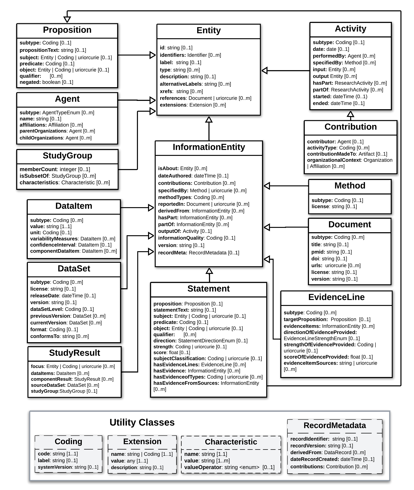
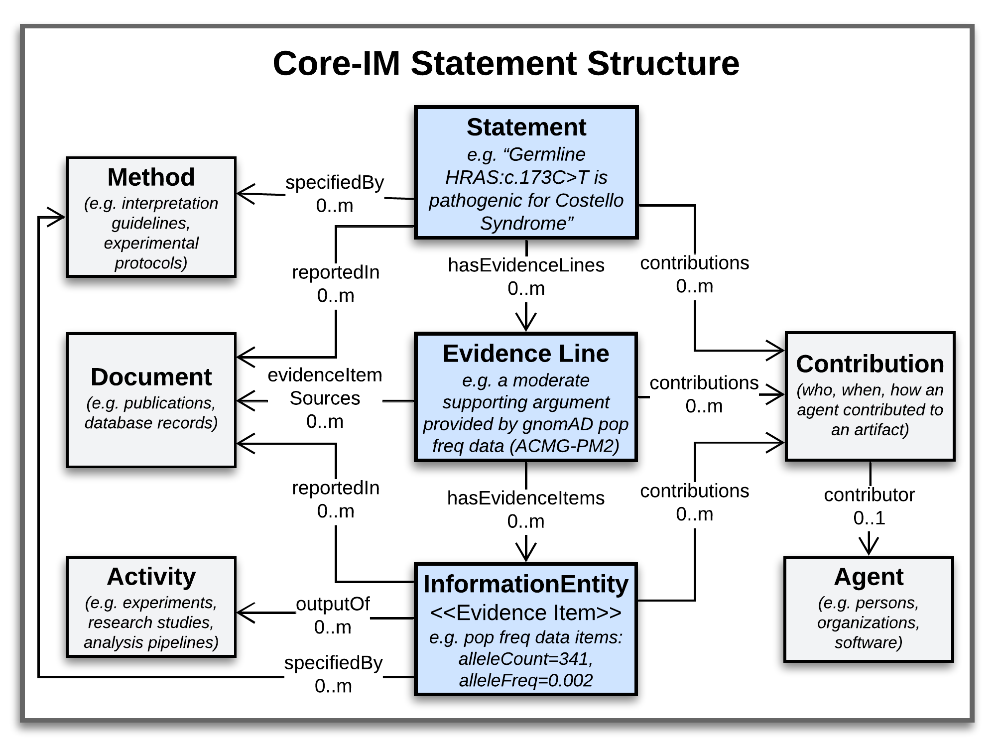

Modeling Foundations
!!!!!!!!!!!!!!!!!!!!

``WORK IN PROGRESS: PLEASE COME BACK SOON``

This document describes modeling standards, patterns, and principles adopted by the VA Specification. 

Variant Representation
@@@@@@@@@@@@@@@@@@@@@@
To represent molecular variations that are subjects of VA Statements, the VA-Spec adopts two complementary GKS standards:

#. The `GA4GH Variant Representation Specification (VRS) <https://vrs.ga4gh.org/en/latest/index.html>`_, which provides JSON Schema for representing many classes of discrete genetic variation, and tools for generating globally-unique computed variant identifiers. VRS variants represent discrete instances of sequence variation in a specified context (reference, location, state) - e.g. the NM_005228.5(EGFR):c.2232_2250del(p.Lys745fs) variant `here <https://www.ncbi.nlm.nih.gov/clinvar/variation/177787/>`_. This includes single continuous alleles, haplotypes, genotypes, and copy number changes.

#. The `GA4GH Categorical Variation Representation Specification (Cat-VRS) <https://github.com/ga4gh/cat-vrs?tab=readme-ov-file>`_, which is built on top of VRS and provides a terminology and data model for describing 'categorical' variation concepts. Categorical variations are intensionally defined sets of variations, based on criteria that must be met for inclusion in a given category. Examples include `BRAF V600 mutations <https://civicdb.org/molecular-profiles/17/summary>`_ and `EGFR exon 19 deletions <https://civicdb.org/molecular-profiles/133/summary>`_. 

VRS and Cat-VRS models are directly imported for use in VA schema, and the VA-Spec reference implementation will incorporate VRS tools for identifier generation, normalization, and validation. See linked documentation above for more information about these specifications.  

VA Statement Representation
@@@@@@@@@@@@@@@@@@@@@@@@@@@

The **Core Information Model (Core-IM)** is a domain-agnostic model for representing statements of knowledge, and the foundation on which Statement-specific VA profiles are built. Below we provide an overview of the Core-IM **Class Hierarchy**, the **Statement Structures** these classes are used to construct, and features of the model that allow explicit representation of **Statement Semantics**. 

Core-IM Class Hierarchy
$$$$$$$$$$$$$$$$$$$$$$$
The initial version of the Core-IM was derived from the SEPIO Core Information Model, through selection of elements needed to support initial VA implementation use cases. A hierarchical view of this model is illustrated in **Figure 1**.

.. core-im-class-hierarchy:

   Core-IM Class Hierarchy

   **Legend** Hierarchical structure of classes and attributes comprising the domain-agnostic Core-IM. Note that a hierarchy of Domain Entity classes has been defined to represent things like Genes, Conditions, and Therapeutic Procedures. This if described separately `here <https://github.com/ga4gh/va-spec/edit/1.x/docs/source/core-information-model/entities/domain-entities/index.rst>`_. 

As VA implementations evolve and new VA profiles are created, more content from SEPIO will be added to support new requirements. The VA-Spec team has partnered with SEPIO developers to ensure coordinated evolution of these two standards.  For more information, see `"What is the SEPIO Framework?" <https://va-ga4gh.readthedocs.io/en/latest/faq.html#what-is-the-sepio-framework>`_, and `"How does the VA-Spec use SEPIO?" <https://va-ga4gh.readthedocs.io/en/latest/faq.html#how-does-the-va-spec-use-the-sepio-framework>`_ FAQs.

Core-IM Statement Structure
$$$$$$$$$$$$$$$$$$$$$$$$$$$
The Core-IM supports Statement-centric approach, where each discrete assertion of knowledge is captured in a self-contained **Statement** object which roots a data structure like that in the figure below. 

.. core-im-statement-data-structure:

Core-IM Class Relationships in Statement Data Structures
**Legend** A class-level view of the 'associative' structure that VA Statements takes (as opposed to the 'hierarchical' structure of Core-IM class definitions that is depicted in the previous figure). Italicized text under class names illustrate the kind of information each class may report in the case of a Variant Pathogenicity Statement supported by Population Allele Frequency evidence.

In this structure, a Statement object roots a central axis, where it is linked to one or more **Evidence Lines** representing discrete arguments for or against it, and each Evidence Line may then be linked to one or more pieces of information used as evidence (i.e. **Evidence Items**) contributing to such an argument. Surrounding the axis are classes that describe the provenance of these core artifacts, including **Contributions** made to them by **Agents**, **Activities** performed in doing so, **Methods** that specify their creation, and **Documents** that describe them. This structure allows precise tracking of provenance information at the level of a Statement and each supporting Evidence Line and Item. A full data example illustrating the structure of a Variant Pathogenicity Statement can be found here (``TO DO``).

Core-IM Statement Semantics
$$$$$$$$$$$$$$$$$$$$$$$$$$$
Every Statement object in the Core-IM puts forth a **Proposition** - a possible fact it assesses or reports to be true. The semantics of this Proposition are explicitly captured using ``subject``, ``predicate``, and ``object`` attributes, and optional ``qualifier`` slot(s) (**Figure 3**). Additional ``direction`` and ``strength`` attributes can report whether the Statement reports the Proposition to be true or false, and the strength of evidence supporting this claim. 

.. core-im-statement-semantics:

.. figure:: images/core-im-statement-semantics.PNG

Explicit Semantics of Core-IM Statements

**Legend** Explicit Statement Semantics are supported by the Core-IM. (a) Model: the Statement model for a Variant Pathogenicity Profile, showing only attributes used to represent the semantics of what a statement reports to be true. (b) Data: a json data example of a Variant Pathogenicity Statement instance, noting elements holding the Statement's proposition and those assessing it's strength and direction. (c) Semantics: the  plain-language meaning of what the statement data structure reports to be true. 

This basic model supports two "modes of use" for Statements: an 'Assertion Mode' which support simple assertions of knowledge, and a 'Proposition Assessment Mode' allowing nuanced representations of the state of evidence surrounding a possible fact. Implementations can choose the mode that best fits their data. Details are provided in the ``Statement`` class page `here <https://va-ga4gh.readthedocs.io/en/latest/core-information-model/entities/information-entities/statement.html#implementation-guidance>`_. 

Study Result Representation
@@@@@@@@@@@@@@@@@@@@@@@@@@@

``COMING SOON``

.. note::  **Study Result Profiles**: While the majority of applications are focused on creating **Statement** profiles, the modeling framework supports profiling of other Core-IM classes, including **Study Results** and **Evidence Lines**. For example, the `CohortAlleleFrequencyStudyResult <https://va-ga4gh.readthedocs.io/en/latest/standard-profiles/study-result-profiles.html#cohort-allele-frequency-study-result>`_ profile specializes the StudyResult class to represent select data from statistical analyses of allele frequencies in different human populations along with methodological and quality metadata. More information on these types of profiles can be found `here <https://va-ga4gh.readthedocs.io/en/latest/modeling-framework.html#profiling-methodology>`_.

Standard Profiles
#################

``COMING SOON``

Types of Profiles
#################

Statement Profiles
@@@@@@@@@@@@@@@@@@

Study Result Profiles
@@@@@@@@@@@@@@@@@@@@@

While the majority of applications of the VA-Spec deal in knowledge statements, and use **Statement** Profiles, the modeling framework supports  profiling of other Core-IM classes such as **Study Result**.  Study Results are used when the information captured represents data items a study or dataset pertaining to some variant of interest, as  opposed to a broader statement of knowledge (e.g, one that may be concluded from interpretation of such data).  

For example, the `CohortAlleleFrequencyStudyResult <https://va-ga4gh.readthedocs.io/en/latest/standard-profiles/study-result-profiles.html#cohort-allele-frequency-study-result>`_ profile specializes the StudyResult class to represent select data from statistical analyses of allele frequencies in different human populations along with methodological and quality metadata.  More information on the StudyResult class and how it can be profiled can be found `here <https://va-ga4gh.readthedocs.io/en/latest/core-information-model/entities/information-entities/study-result.html>`_  and `here <https://va-ga4gh.readthedocs.io/en/latest/profiling-methodology.html>`_.

