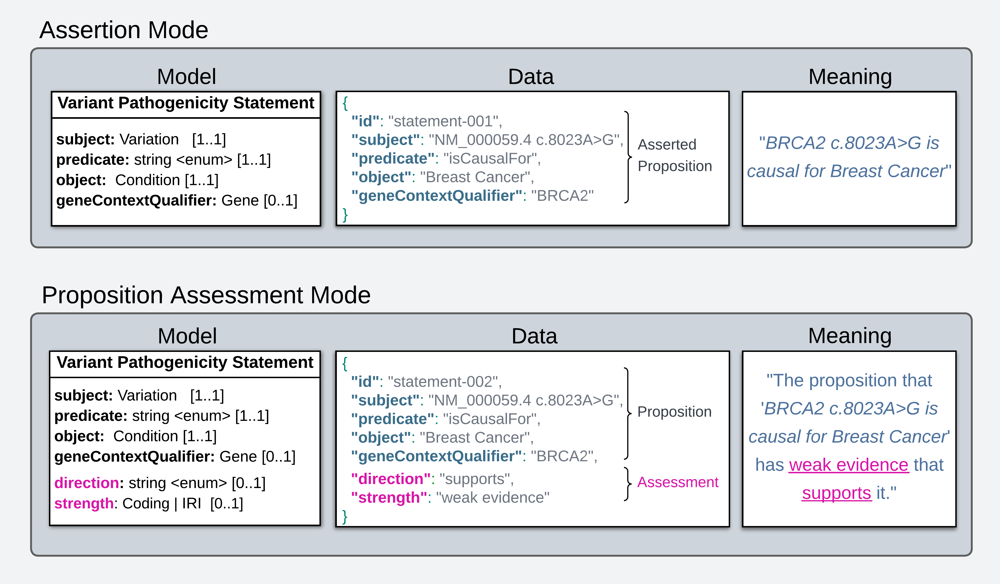
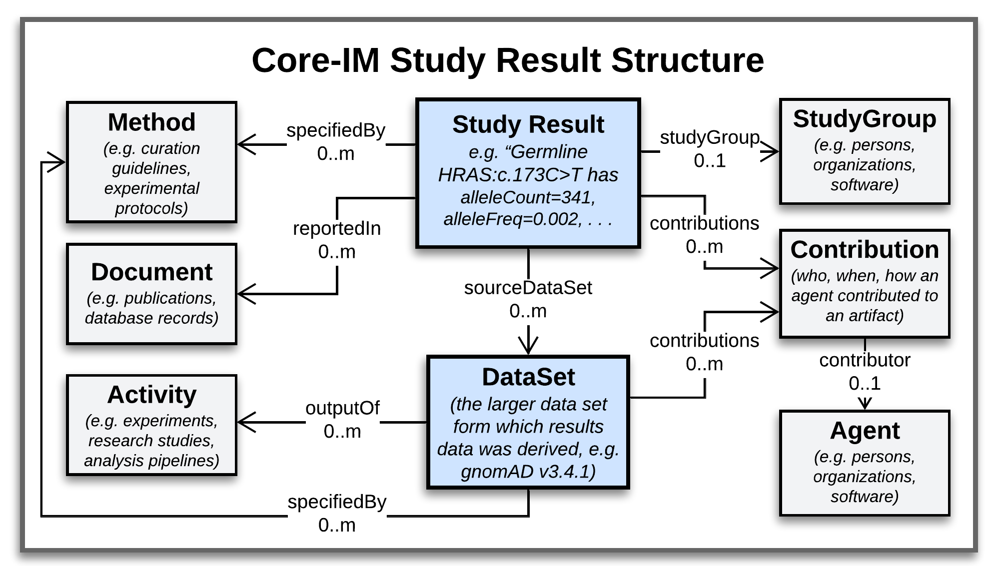

.. _modeling-foundations:

Modeling Foundations
!!!!!!!!!!!!!!!!!!!!

``PREREQUISITES:`` :ref:`Introduction<introduction>`, :ref:`Data Example<variant-pathogenicity-statement-example>`, :ref:`Core Information Model<core-information-model>`

This document describes modeling standards, patterns, and principles employed by the VA Specification for representing genetic variation and statements of knowledge about them. 

Variant Representation
@@@@@@@@@@@@@@@@@@@@@@
To represent molecular variations that are subjects of VA Statements, the VA-Spec adopts two complementary GKS standards:

#. The `GA4GH Variant Representation Specification (VRS) <https://vrs.ga4gh.org/en/latest/index.html>`_, which provides JSON Schema for representing many classes of discrete genetic variation, and tools for generating globally-unique computed variant identifiers. VRS variants represent discrete instances of sequence variation in a specified context (reference, location, state) - e.g. the NM_005228.5(EGFR):c.2232_2250del(p.Lys745fs) variant `here <https://www.ncbi.nlm.nih.gov/clinvar/variation/177787/>`_. This includes single continuous alleles, haplotypes, genotypes, and copy number changes.

#. The `GA4GH Categorical Variation Representation Specification (Cat-VRS) <https://github.com/ga4gh/cat-vrs?tab=readme-ov-file>`_, which is built on top of VRS and provides a terminology and data model for describing 'categorical' variation concepts. Categorical variations are intensionally defined sets of variations, based on criteria that must be met for inclusion in a given category. Examples include `BRAF V600 mutations <https://civicdb.org/molecular-profiles/17/summary>`_ and `EGFR exon 19 deletions <https://civicdb.org/molecular-profiles/133/summary>`_. 

VRS and Cat-VRS models are directly imported for use in VA schema, and the VA-Spec reference implementation will incorporate VRS tools for identifier generation, normalization, and validation. See linked documentation above for more information about these specifications.  

Statement Representation
@@@@@@@@@@@@@@@@@@@@@@@@

In the VA-Spec data, each assertion of knowledge about a variant is captured in a self-contained **Statement** object. The :ref:`GKS Core-IM<core-information-model>` provides a rich and powerful model where:

 * the :ref:`Statement <Statement>` class roots a larger data structure supporting clear and precise tracking of the evidence and provenance information
 * the semantics of what is assessed or reported to be true in a Statement (i.e. its 'Proposition') are explicitly structured in terms of subject, predicate, object, and qualifier attributes
 * Statements can report a more nuanced assessment of the state of confidence or evidence surrounding this Proposition

These features of the Core-IM Statement model are described below. 

Statement Data Structure
$$$$$$$$$$$$$$$$$$$$$$$$

In VA-Spec data, a Statement object roots the larger data structure below.

.. core-im-statement-data-structure:

.. figure:: images/core-im-statement-data-structure.png

   Statement Data Structure

   **Legend** A class-level view of the Statement-based structures that manifest in VA-Spec data. Italicized text under class names illustrate the kind of information each class may report, in the case of a Variant Pathogenicity Statement supported by Population Allele Frequency evidence.

In this structure:
 * A **Statement** object roots a central axis where it is linked to one or more **Evidence Lines** representing discrete arguments for or against it.
 * Each **Evidence Line** may then be linked to one or more **Evidence Items** - specific **Information Entities** that were used to build an evidence-based argument. 
 * Surrounding this central axis are classes that describe the provenance of these artifacts, including **Contributions** made to them by **Agents**, **Activities** performed in doing so, **Methods** that specify their creation, and **Documents** that describe them. 

This structure allows tracking of provenance information at the level of a Statement and each supporting Evidence Line and Item. A simple data example illustrating the structure for a Variant Pathogenicity Statement can be found :ref:`here<variant-pathogenicity-statement-example>`.

.. statement-semantics:

Statement Semantics
$$$$$$$$$$$$$$$$$$$
Every Statement object in the Core-IM puts forth a **Proposition** - a possible fact it assesses or reports to be true. The semantics of this Proposition are explicitly captured using ``subject``, ``predicate``, ``object``, and optional ``qualifier`` attributes (SPOQ). 

An assessment of the Proposition's validity can be captured using ``direction`` and ``strength``  (DS) attributes - which indicate whether the Proposition is reported to be true or false, and the amount of confidence or evidence supporting behind claim. 

This "SPOQ-DS" model supports two **"Modes of Use**" for Statements, which differ in what they say about their Proposition, and can be distinguished by how the ``direction`` and ``strength`` or ``score`` attributes are populated. 

#. In **"Assertion Mode"**, a Statement simply reports an SPOQ proposition to be true or false (e.g. that "BRCA2 c.8023A>G is pathogenic for Breast Cancer"). The ``strength`` attribute is not populated, and ``direction`` is assumed to be true/supports if not otherwise indicated. This mode is used by project reporting conclusive assertions about a domain of discourse, but not providing confidence or evidence level assessments.

#. In **"Proposition Assessment Mode"**, a Statement describes the overall state of evidence and/or confidence surrounding the SPOQ proposition - which is not necessarily being asserted as true. The ``direction`` and ``strength`` attributes are populated, which allows for more nuanced Statements reporting things like "there is *weak* evidence *supporting* the proposition that 'BRCA2 c.8023A>G is causal for Breast Cancer'", or "we have *high confidence* that the proposition 'PAH:c.1285C>A is causal for Phenylketonuria is *false*").  This mode is used in projects to track the evolving state of support for propositions of interest, as curators actively collect evidence and work toward a conclusive assertion.   

.. core-im-statement-semantics:

   Statement Semantics in Two Modes of Use 

   **Assertion Mode** vs **Proposition Assessment Mode** semantics for a Variant Pathogenicity Statement. For each mode, left panels show the **Model** attributes used to represent statement semantics; center panels show **Data** examples of statement instances; and right panels report the plain-language **Meaning** of what each statement data structure reports to be true. 

Note that many VA Standard Profiles, including the :ref:`Variant Pathogenicity Statement Profile<variant-pathogenicity-statement>`, contain the ``direction`` and ``strength`` attributes, and thus could be use to support either Mode of Use. 

Implementations should choose the mode that best fits their data and use case when generating VA-compliant datasets - leveraging ``direction`` and ``strength`` attributes only if they wish to describe the state of evidence or confidence surrounding a possible fact.

Study Result Representation
@@@@@@@@@@@@@@@@@@@@@@@@@@@

Many users of the VA-Spec provide curated collections of data about a particular variant from a particular study or analysis, as opposed to higher order assertions of knowledge. The :ref:`GKS Core-IM<core-information-model>` defines the :ref:`Study Result <StudyResult>` class to support this use case.

Like the Statement class, it roots a larger data structure supporting clear and precise tracking of the evidence and provenance information, and provides explicit semantics linking a variant to specific data and study context. These features of the Core-IM Study Result model are described below. 

Study Result Data Structure
$$$$$$$$$$$$$$$$$$$$$$$$$$$

In VA-Spec data, a Study Result object roots the data structure below:

.. core-im-study-result-data-structure:

   Study Result Data Structure

   **Legend** A class-level view of the Study Result-based structures that manifest in VA-Spec data. Italicized text under class names illustrate the kind of information each class may report in the case of a Cohort Allele Frequency study Result reporting data from the gnomAD dataset about a particular variant.

In this structure, the data items collected in the **Study Result** can be linked to the larger **Data Set** or sets from which they came, and a description of the **Study Group** from which the data was collected. And as with Statements, clear and precise provenance information about the Study Result and DataSet can be captured in supporting **Method**, **Document**, **Contribution**, **Agent**, and **Activity** objects.

Study Result Semantics
$$$$$$$$$$$$$$$$$$$$$$

