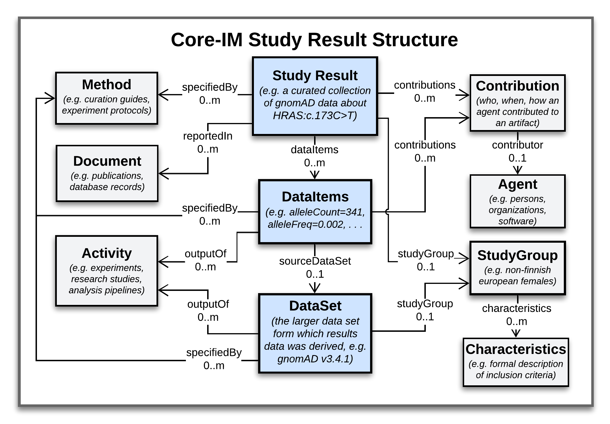

Modeling Foundations
!!!!!!!!!!!!!!!!!!!!

``WORK IN PROGRESS: PLEASE COME BACK SOON``

This document describes modeling standards, patterns, and principles adopted by the VA Specification. 

Variant Representation
@@@@@@@@@@@@@@@@@@@@@@
To represent molecular variations that are subjects of VA Statements, the VA-Spec adopts two complementary GKS standards:

#. The `GA4GH Variant Representation Specification (VRS) <https://vrs.ga4gh.org/en/latest/index.html>`_, which provides JSON Schema for representing many classes of discrete genetic variation, and tools for generating globally-unique computed variant identifiers. VRS variants represent discrete instances of sequence variation in a specified context (reference, location, state) - e.g. the NM_005228.5(EGFR):c.2232_2250del(p.Lys745fs) variant `here <https://www.ncbi.nlm.nih.gov/clinvar/variation/177787/>`_. This includes single continuous alleles, haplotypes, genotypes, and copy number changes.

#. The `GA4GH Categorical Variation Representation Specification (Cat-VRS) <https://github.com/ga4gh/cat-vrs?tab=readme-ov-file>`_, which is built on top of VRS and provides a terminology and data model for describing 'categorical' variation concepts. Categorical variations are intensionally defined sets of variations, based on criteria that must be met for inclusion in a given category. Examples include `BRAF V600 mutations <https://civicdb.org/molecular-profiles/17/summary>`_ and `EGFR exon 19 deletions <https://civicdb.org/molecular-profiles/133/summary>`_. 

VRS and Cat-VRS models are directly imported for use in VA schema, and the VA-Spec reference implementation will incorporate VRS tools for identifier generation, normalization, and validation. See linked documentation above for more information about these specifications.  

Core Information Model
@@@@@@@@@@@@@@@@@@@@@@

The **Core Information Model (Core-IM)** is a domain-agnostic model that supports explicit representation of scientific knowledge, and the evidence and provenance supporting it. The initial version of the Core-IM was derived from the `SEPIO Core Information Model <https://sepio-framework.github.io/sepio-linkml/core-im-diagram/>`_, through selection of elements needed to support initial VA implementation use cases. 

In the VA-Spec, the Core-IM is the foundation on which Profiles for specific types of Statements and Study Results about molecular variation are built.  Below we provide an overview of the Core-IM **Class Hierarchy**, the **Statement** and **Study Result** data structures that can be built from it, and features of the model that allow explicit representation of **Statement Semantics**. 

Class Hierarchy
$$$$$$$$$$$$$$$

A hierarchical view of the Core-IM is illustrated below, and detailed class and attribute definitions and implementation guidance can be found `here <https://va-ga4gh.readthedocs.io/en/latest/core-information-model/index.html>`_.  

.. core-im-class-hierarchy:

.. figure:: images/core-im-class-hierarchy.png

   Core-IM Class Hierarchy

   **Legend** Hierarchical structure of classes and attributes comprising the domain-agnostic Core-IM. Note that a hierarchy of Domain Entity classes has been defined to represent things like Genes, Conditions, and Therapeutic Procedures. This if described separately `here <https://github.com/ga4gh/va-spec/edit/1.x/docs/source/core-information-model/entities/domain-entities/index.rst>`_. 

As VA implementations evolve and new VA profiles are created, more content from SEPIO will be added to support new requirements. The VA-Spec team has partnered with SEPIO developers to ensure coordinated evolution of these two standards.  For more information, see `"What is the SEPIO Framework?" <https://va-ga4gh.readthedocs.io/en/latest/faq.html#what-is-the-sepio-framework>`_, and `"How does the VA-Spec use SEPIO?" <https://va-ga4gh.readthedocs.io/en/latest/faq.html#how-does-the-va-spec-use-the-sepio-framework>`_ FAQs.

Statement Structure
$$$$$$$$$$$$$$$$$$$
The Core-IM supports knowlege representation using a Statement-centric approach, where each discrete assertion of knowledge is captured in a self-contained ``Statement`` object which roots a data structure like that in the figure below. 

.. core-im-statement-data-structure:

.. figure:: images/core-im-statement-data-structure.png

   Core-IM Classes and Relationships in Statement Data Structures

   **Legend** A class-level view of the 'associative' structure that Core-IM Statements take (as opposed to the 'hierarchical' structure of Core-IM class definitions that is depicted in the previous figure). Italicized text under class names illustrate the kind of information each class may report in the case of a Variant Pathogenicity Statement supported by Population Allele Frequency evidence.

In this structure, a **Statement** object roots a central axis where it is linked to one or more **Evidence Lines** representing discrete arguments for or against it, and each Evidence Line may then be linked to one or more pieces of information used to build as evidence such an argument (i.e. **Evidence Items**). Surrounding this Statement-EvidenceLine-EvidenceItem axis are classes that describe the provenance of these artifacts, including **Contributions** made to them by **Agents**, **Activities** performed in doing so, **Methods** that specify their creation, and **Documents** that describe them. This structure allows precise tracking of provenance information at the level of a Statement and each supporting Evidence Line and Item. A simple data example illustrating the structure of a Variant Pathogenicity Statement can be found `here <https://va-ga4gh.readthedocs.io/en/latest/examples/variant-pathogenicity-statement.html>`_.

Statement Semantics
$$$$$$$$$$$$$$$$$$$
Every Statement object in the Core-IM puts forth a **Proposition** - a possible fact it assesses or reports to be true. The semantics of this Proposition are explicitly captured using ``subject``, ``predicate``, and ``object`` attributes, and optional ``qualifier`` attribute(s). An assessment of the Proposition's validity can be captured using ``direction``, ``strength``, and ``score`` attributes - which indicate whether the Proposition is reported to be true or false, and the level of confidence or evidence supporting this claim. For details, see `here <https://va-ga4gh.readthedocs.io/en/latest/core-information-model/entities/information-entities/statement.html>`_. 

This model supports two "modes of use" for Statements, which differ in what they say about their Proposition, and can be distinguished by how the ``direction`` and ``strength`` or ``score`` attributes are populated. 

#. In **"Assertion Mode"**, a Statement simply reports an SPOQ proposition to be true or false (e.g. that "BRCA2 c.8023A>G is pathogenic for Breast Cancer"). The``strength` and ``score`` attributes are not populated, and ``direction`` is assumed true/supports if not otherwise indicated.  This mode is used by project reporting conclusive assertions about a domain of discourse, but not providing confidence or evidence level assessments.

#. In **"Proposition Assessment Mode"**, a Statement describes the overall state of evidence and/or confidence surrounding the SPOQ proposition - which is not necessarily being asserted as true. The ``direction`` and ``strength`` or ``score`` attributes are populated, which allows for Statements to report things like "there is *weak* evidence *supporting* the proposition that 'BRCA2 c.8023A>G is causal for Breast Cancer'", or "we have *high confidence* that the proposition 'PAH:c.1285C>A is causal for Phenylketonuria is *false*").  This mode is used in projects to track the evolving state of support for propositions of interest, as curators actively collect evidence and work toward a conclusive assertion.   

.. core-im-statement-semantics:

.. figure:: images/core-im-statement-semantics.png

   Explicit Semantics of Core-IM Statements

   **Legend** Explicit semantics in **Assertion Mode** vs **Proposition Assessment Mode**, for a Variant Pathogenicity Statement. For each mode, left panels show the **Model** attributes used to represent statement semantics; center panels show **Data** examples of statement instances; and right panels report the plain-language **Meaning** of what each statement data structure reports to be true. 

Many VA Standard Profiles, including the Variant Pathogenicity Statement Profile, contain the ``direction``, ``strength``, and ``score`` attributes, and thus could be use to support either Mode of Use. Implementations should choose the mode that best fits their data and use case when generating VA-compliant datasets - leveraging Proposition Assessment Mode if they wish to provide nuanced representations of the state of evidence or confidence surrounding a possible fact.

Study Result Representation
@@@@@@@@@@@@@@@@@@@@@@@@@@@

The Core-IM also supports Study Result rooted data structures, where curated collections of data about a particular variant from a particular study or analysis can be captured and described in a self-contained ``StudyResult`` object, which roots a data structure like that in the figure below. 

.. core-im-study-result-data-structure:

   Core-IM Classes and Relationships in Study Result Data Structures

   **Legend** A class-level view of the 'associative' structure that Core-IM Study Results take (as opposed to the 'hierarchical' structure of Core-IM class definitions that is depicted above). Italicized text under class names illustrate the kind of information each class may report in the case of a Cohort Allele Frequency study Result repoorting data from the gnomAD dataset about a particular variant.

--------------

**Standard Profiles**

``COMING SOON``

**Types of Profiles**

**Statement Profiles**

**Study Result Profiles**

While the majority of applications of the VA-Spec deal in knowledge statements, and use **Statement** Profiles, the modeling framework supports  profiling of other Core-IM classes such as **Study Result**.  Study Results are used when the information captured represents data items a study or dataset pertaining to some variant of interest, as  opposed to a broader statement of knowledge (e.g, one that may be concluded from interpretation of such data).  

For example, the `CohortAlleleFrequencyStudyResult <https://va-ga4gh.readthedocs.io/en/latest/standard-profiles/study-result-profiles.html#cohort-allele-frequency-study-result>`_ profile specializes the StudyResult class to represent select data from statistical analyses of allele frequencies in different human populations along with methodological and quality metadata.  More information on the StudyResult class and how it can be profiled can be found `here <https://va-ga4gh.readthedocs.io/en/latest/core-information-model/entities/information-entities/study-result.html>`_  and `here <https://va-ga4gh.readthedocs.io/en/latest/profiling-methodology.html>`_.

