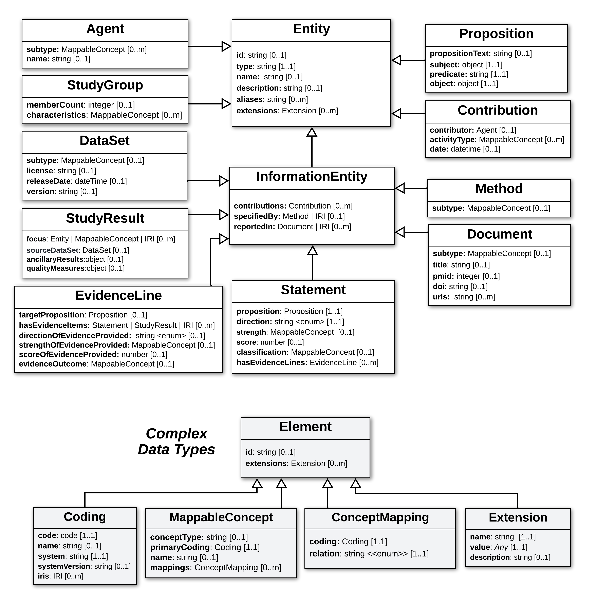

.. _core-classes:

Core Classes
!!!!!!!!!!!!

The diagram below shows a hierarchical view of classes in the VA Core Model below, where attributes are inherited by child classes.

.. core-class-hierarchy:

   Core Class Hierarchy

   **Legend** Hierarchical structure of classes and attributes comprising the domain-agnostic VA Core Model. Classes outlined in blue represent the keystone classes that root most VA data structures. Minimal classes for domain entities such Conditions and Therapies has been defined in the model :ref:`here <domain-entities>` but are not shown above.

Three classes in particular align with the levels of information that are provided by most community databases, and curated in most variant interpretation platform:

- :ref:`Statements <Statement>`: assertions of general knowledge about a variant - e.g. classification of the PTEN:c.35A>T variant as likely pathogenic in the ClinVar knowledgebase.
- :ref:`Study Results <StudyResult>`:  collections of data items and results about a specific variant from a particular study or analysis - e.g. cohort allele frequency data and scores about PTEN:c.35A>T in different populations from the gnomAD dataset.
- :ref:`Evidence Lines <EvidenceLine>`: assessments of how a specific set of information is interpreted as evidence for some possible fact (which may ultimately be asserted as true or false in a Statement), e.g. assessment of the strength and direction of evidence population frequency data provides for the possible pathogenicity of PTEN:c.35A>T.

These **Keystone Classes** (blue) are the basis of :ref:`Profiles <va-profiles>` supported by the VA-Spec, and the data strucutres that can be built around each are described in the next section. 

The remaining **Primary Classes**  (white) are attached to these core classes to represent provenance information describing how, when, by whom, and using what resources they were created. 

The **Complex Data Types** (grey) hold collections of related fields that are used to hold as values of attributes in the primary classes (e.g. see the many attributes that take a MappableConept as thier value). 

.. important:: **A Note about Propositions** 

   **Propositions** provide a referencable and re-usable structure that encapsulates the abstract meaning of possible facts that may be asserted/assessed in a **Statement**, or toward which evidence is interpreted in an **Evidence Line**. For example, in the :ref:`Example Scenario <example-scenario>` the same Proposition object is used to capture the core meaning of what the root Statement asserts to be true, and what each of its supporting Evidence Lines evaluates a specific type of evidence against. Propositions are used only in the context of Statement and Evidence Line classes, and convey no knowledge on their own.  For more information, see the :ref:`Proposition <Proposition>` page, and related :ref:`Design Decision <use-of-propositions>`.

.. important:: **A Note about Propositions**:  **Propositions** provide a referencable and re-usable structure that encapsulates the abstract meaning of possible facts that may be asserted/assessed in a **Statement**, or toward which evidence is interpreted in an **Evidence Line**. For example, in the :ref:`Example Scenario <example-scenario>` the same Proposition object is used to capture the core meaning of what the root Statement asserts to be true, and what each of its supporting Evidence Lines evaluates a specific type of evidence against. Propositions are used only in the context of Statement and Evidence Line classes, and convey no knowledge on their own.  For more information, see the :ref:`Proposition <Proposition>` page, and related :ref:`Design Decision <use-of-propositions>`.

.. important:: **Propositions** provide a referencable and re-usable structure that encapsulates the abstract meaning of possible facts that may be asserted/assessed in a **Statement**, or toward which evidence is interpreted in an **Evidence Line**. For example, in the :ref:`Example Scenario <example-scenario>` the same Proposition object is used to capture the core meaning of what the root Statement asserts to be true, and what each of its supporting Evidence Lines evaluates a specific type of evidence against. Propositions are used only in the context of Statement and Evidence Line classes, and convey no knowledge on their own.  For more information, see the :ref:`Proposition <Proposition>` page, and related :ref:`Design Decision <use-of-propositions>`.
