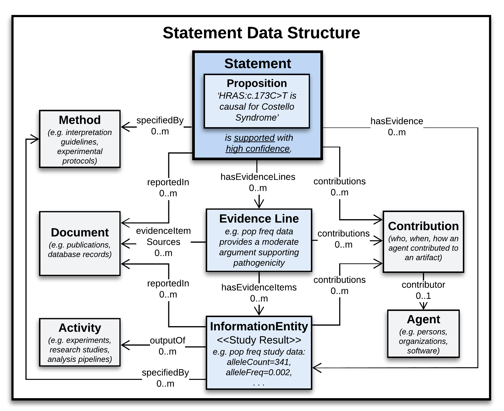
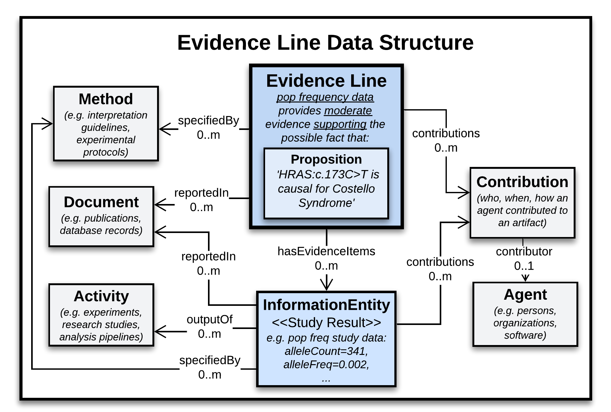
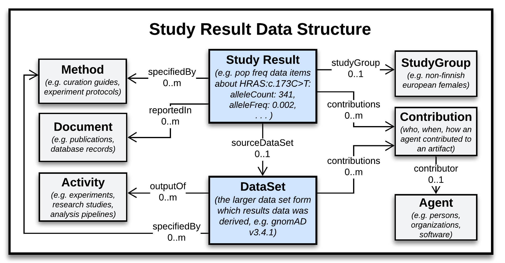

.. _data-structures:

Data Structures
!!!!!!!!!!!!!!!

Below we describe the data structures that can be built around three key classes in the VA Core Model: :ref:`Statement <Statement>`, :ref:`Study Result <StudyResult>`, and :ref:`Evidence Line <EvidenceLine>`. 

These classes represent the kinds of artifacts provided by most community databases and interpretation platforms. 

Accordingly, they are the basis of :ref:`VA Profiles <va-profiles>` provided by the VA-Spec, which are used by implementations to structure and exchange variant knowledge. 

.. _statement-structure:

Statement Structure
###################

:ref:`Statements <Statement>` represent *assertions* or *assessments* of general knowledge about a variant - e.g. an *assertion* that *'HRAS:c.173C>T is pathogenic for Costello Syndrome*, or an *assessment* that there is presently only moderate evidence supporting this possible fact.

In VA-Spec, the :ref:`Statement <Statement>` class and its :ref:`profiles <community-profiles>` can support the general data structure below. 

.. core-im-statement-data-structure:

   Statement Data Structure

   **Legend** A class-level view of the Statement-based structures supported in VA-Spec data. Italicized text in each class exemplify the kind of information each may capture, here in the case of a Variant Pathogenicity Statement supported by Population Allele Frequency evidence.

In this structure:

* A **Statement** roots a central axis where it is linked to zero or more **Evidence Lines** representing discrete arguments for or against it.
* Each Evidence Line may be linked to zero or more pieces of information (e.g. **Study Results**) that were used to build its evidence-based argument.
* The **Proposition** contained in the Statement object encapsulates a structured representation of the possible fact that the Statement may assert or assess (e.g. that *'HRAS:c.173C>T is causal for Costello Syndrome'*). Unless otherwise stated, this is the same proposition against which evidence is assessed in supporting Evidence Lines. 
* Surrounding this central axis are classes that describe the provenance of the central artifacts, including **Contributions** made to them by **Agents**, **Activities** performed in doing so, **Methods** that specify their creation, and **Documents** that describe them.

A data example illustrating this structure for a Variant Pathogenicity Statement can be found :ref:`here <acmg-variant-pathogenicity-statement-example-with-evidence>`.

More on the internal semantics of Statement objects can be found in the :ref:`Statement Class <Statement>` page. And more on Propositions in the :ref:`next section <propositions>`.

.. _evidence-line-structure:

Evidence Line Structure
#######################

:ref:`Evidence Lines <EvidenceLine>` represent assessments of how a specific set of information is interpreted as an argument for or against some possible fact (their **target proposition**), which may ultimately be asserted as true or false in a Statement. 

This assessment reports the **strength** and **direction** of evidence provided by the interpreted evidence. For example, an assessment that some set of gnomAD allele frequency data about the HRAS:c.173C>T variant provides **moderate** evidence **supporting** a proposition that it causes Costello Syndrome.

As seen in the :ref:`Statement Structure <statement-structure>` above, Evidence Lines may be linked to a Statement for which they represent a supporting or disputing argument. However some organizations 'pre-curate' such arguments in the absence of a definitive Statement they support, so that these Evidence Lines can be retrieved and collectively assessed once sufficient evidence exists to make a definitive assertion about their shared target proposition. 

In VA-Spec, the :ref:`Evidence Line <EvidenceLine>` class and its :ref:`profiles <community-profiles>` can support the general data structure below. 

.. core-im-evidence-line-structure:

   Evidence Line Data Structure

   **Legend** A class-level view of the Evidence Line-based structures supported in VA-Spec data. Italicized text in each class exemplify the kind of information each may capture - here for an Evidence Line representing a *moderate* argument *supporting* the pathogenicity of a particular variant, based on allele frequency data from gnomAD.

In this structure:

* An **Evidence Line** roots a central axis where it is linked zero or more pieces of information (e.g. **Study Results**) that were used to build the arguemnt it represents.
* The **Proposition** contained in the Evidence Line object encapsulates a structured representation of the possible fact toward which evidence is interpreted and scored (e.g. that *'HRAS:c.173C>T is causal for Costello Syndrome'* - for which gnomAD data is assessed to provide moderate support). 

   * Note that this target proposition can be omitted if an Evidence Line is attached to a Statement with the same proposition (as in the previous Statement diagram) - but otherwise should be provided. 
* As with Statements, classes surrounding this central axis are used to describe the provenance of the Evidence Lines and its Evidence Items.

A data example illustrating this structure for Evidence Lines supporting a Variant Pathogenicity Statement can be found :ref:`here <acmg-variant-pathogenicity-statement-example-with-evidence>`.

More on the internal semantics of Evidence Line objects can be found in the :ref:`Evidence Line Class <EvidenceLine>` page. More on Propositions in the :ref:`next section <propositions>`.

.. _study-result-structure:

Study Result Structure
######################

:ref:`Study Results <StudyResult>` represent defined collections of data items about a specific variant that result from a particular study or analysis - e.g. select cohort allele frequency data and scores about HRAS:c.173C>T in different populations from the gnomAD dataset. Curators often collect and assess such collections of data as evidence during the process of interpreting a particular variant - which may result in a higher order Statement about it (e.g. a pathogenicity classification). 

As seen in the previous diagrams, Study Results may be linked to Evidence Lines or directly to Statements they support. However, some organizations 'pre-curate' and store Study Results as stand-alone artifacts, which subsequently can be retrieved and assessed as evidence for higher order Statements for which they may provide support. 

In VA-Spec, the :ref:`Study Result <StudyResult>` class and its :ref:`profiles <study-result-profiles>` can support the general data structure below. 

.. core-im-study-result-data-structure:

   Study Result Data Structure

   **Legend** A class-level view of the Study Result-based structures supported in VA-Spec data. Italicized text in each class exemplify the kind of information each may capture - here in the case of a Cohort Allele Frequency Study Result reporting data from the gnomAD dataset about a particular variant.

In this structure: 

* A **Study Result** and the data items it holds can be linked to the larger **Data Set** from which they came, and a description of the **Study Group** from which the data was collected. 
* Note that no **Proposition** object is used here, because Study Results represent more foundational data, and do not assert or assess evidence for possible facts about the domain. 
* As with Statements and Evidence Lines, surrounding classes can be used to describe the provenance of the Study Result and its data items.

A data example illustrating this structure for a Study Result interpreted as evidence for a Variant Pathogenicity Statement can be found :ref:`here <acmg-variant-pathogenicity-statement-example-with-evidence>`.

More on the internal semantics of Study Result objects can be found in the :ref:`Study Result Class <StudyResult>` page.
