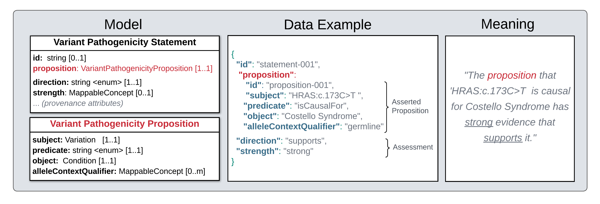
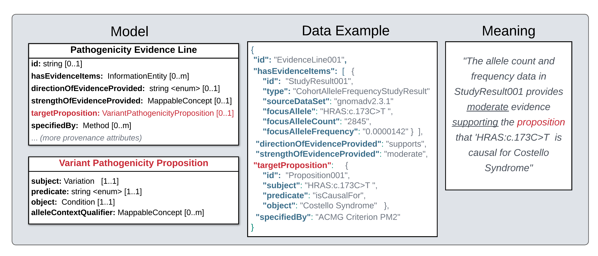

.. _propositions:

Propositions
!!!!!!!!!!!!

**Propositions** represent possible facts about the domain of discourse that may be true or false. They are abstract entities that capture a ‘sharable’ piece of meaning whose identity and existence is independent of space and time, and make no claim as to whether the sentiment it expresses is true or not.

As illustrated in the :ref:`previous section <data-structures>`, the job of a **Proposition** object is to encapsulate a structured representation of a possible fact so it can be referenced and reused across **Statements** and **Evidence Lines**. 

* In a Statement, a proposition may be *asserted* to be true or false, or *assesesd* to report the current level of confidence/evidence supporting it (e.g. "there is presently *moderate* evidence *supporting* the proposition that 'HRAS:c.173C>T causes Costello Syndrome'"). This role of propositions is highlighted in the data example below. 

   **Legend** Left panel: Abridged version of the Variant Pathogenicity Statement model. Center Panel: An example of a Variant Pathogenicity Statement object (note use of shorthand syntax to capture values that should be wrapped in MappableConcepts). Right Panel: Plain language meaning of what structured data in the example reports to be true. Use of propositions in each panel is highlighted in red text. 

* In an Evidence Line, a proposition captures the possible fact toward which evidence items are assessed and scored (e.g. that gnomAD population frequency evidence items are evaluated toward proposition that "HRAS:c.173C>T is causal for Costello Syndrome" when assessing the evidence as   providing *moderate* *support*). This role of propositions is highlighted in the data example below. 

   **Legend** Left panel: Abridged version of a Pathogenicity Evidence Line model. Center Panel: An example of a Pathogenicity Evidence Line object (note use of shorthand syntax to capture values that should be wrapped in MappableConcepts). Right Panel: Plain language meaning of what structured data in the example reports to be true. Use of propositions in each panel is highlighted in red text. 

In VA-Spec data, Propositions are used only in the context of Statement and Evidence Line classes, and convey no knowledge on their own. While propositions are *required* in Statements, they are *optional* in Evidence Lines - and can be omitted if the Evidence Line is attached to a Statement with the same proposition. For example, in the :ref:`data example here <<acmg-variant-pathogenicity-statement-with-evidence>` the root Statement asserts the same proposition as that toward which its two Evidence Lines evaluate the support provided by population frequency and functional impact data. This ``Proposition001`` object is explicitly referenced in the Evidence Lines in the ddta example, but omission of this reference is permissible, and would imply that the target proposition here is the same as that in the root Statement,. 

For more information, see the :ref:`Proposition <Proposition>` page, and related :ref:`Design Decision <use-of-propositions>`.

