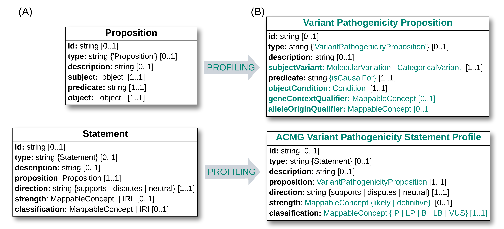

.. _profiling-methodology:

Profiling Methodology
!!!!!!!!!!!!!!!!!!!!!

Overview
########

In practice, VA-Spec schema used to represent actual data are **'Profiles'** defined to constrain and/or extend core Statement, Study Result, and Evidence Line classes to support a specific type of variant knowledge. 

The VA-Spec defines a **Profiling Methodology** which specifies the types of specializations and extensions that are permitted in authoring profiles, as illustrated in the diagram and detailed in the 'Profiling Tasks` below. 

.. _profiling-methodology

    Profiling specializations defined in Variant Pathogenicity profiles.

   (A) Core Proposition and Statement classes and a subset of their attributes. (B) ACMG-based Variant Pathogenicity and Statement profiles derived from these core classes, with specializations highlighted in green. Text in curly braces are enumeratons. The actual VA-Spec v1.0 schema for these profiles are :ref:`here <variant-pathogenicity-proposition>` and :ref:`here <variant-pathogenicity-statement-acmg-2015>`. 

Profiling Tasks
###############

Conceptually, profiling tasks supported by the methodology, and illustrated in the example above, include:

.. list-table::
   :class: clean-wrap
   :header-rows: 1
   :align: left
   :widths: auto

   *  -     Profiling Task
      -               Example
   *  - Defining domain-specific subtypes of general purpose Core IM classes
      - Specialization of ``Proposition`` -> ``VariantPathogenicityProposition``
   *  - Defining attributes to capture domain-specific information
      -  Statement qualifiers ``geneContextQualifier`` and ``alleleoriginQualifier``
   *  - Define or import classes for domain entities that profiles are about
      - The Variant Pathogenicity Proposition profile, uses ``MolecularVariation`` and ``CategoricalVariation`` classes imported from VRS and CatVRS, and a ``Condition`` class defined in VA-Spec
   *  - Constrain values of core attributes to take specific types as values
      - Restricting the ``VariantPathogenicityStatement.object`` field to take a ``Condition`` as its value
   *  - Define value sets and binding them to attributes taking coded values.
      - Restricting nested fields in the MappableConcept object taken by ``VariantPathogenicityStatement.classification`` to a set of enumerated values based on ACMG Guideline temrinology.
   *  - Refining cardinality of select attributes 
      - Making ``Statement.classification`` a required field in the ACMG Variant Pathogenicity Statement.

Profile Authoring
#################

Version 1.0 of the VA-Spec relies on two distinct mechanisms for authoring different categories of Profiles. 

**1. Inheritance-Based Profiling** (for defining "Base" Profiles):

- **Description**: Specializes generic VA core classes for a particular type of knowledge, through formal definition of concrete subclasses.
- **Mechanism**: Bespoke `GKS Metaschema Processor (MSP) <https://github.com/ga4gh/gks-metaschema>`_  keywords (``inherits``, ``extends``) and tooling to implement class inheritance and attribute extension not natively supported by JSON Schema.
- **Application**: "Base Profiles" for  :ref:`Propositions <proposition-profiles>` and :ref:`Study Results <study-result-profiles>`, which can be used/referenced within Statement and Evidence Line profiles.
- **Rationale**: Allows for the types of attribute extension and addition that are applied in these Base Profiles (e.g. to specialize Proposition ``subject`` and ``object`` attributes, and create specific Proposition qualifiers and StudyResult data items)

 **Inheritance-Based Profiling Example**: 

.. code-block:: yaml

  # From the source yaml file that authors the Variant Pathogenicity Proposition Base Profile

  VariantPathogenicityProposition:
    inherits: ClinicalVariantProposition           # MSP inherits keyword
    maturity: trial use
    type: object
    description: A proposition describing the role of a variant in causing a heritable condition.
    properties:
      objectCondition:
        extends: object                            # MSP extends keyword
        oneOf:
          - $ref: Condition
          - $refCurie: gks.core:iriReference
        description: The :ref:`Condition` for which the variant impact is stated.
      penetranceQualifier:                         # Addition of new qualifier attribute
        $refCurie: gks.core:MappableConcept
        description: Reports the penetrance of the pathogenic effect... 

**2. Composition-Based Profiling** (for defining "Community" Profiles):

- **Description**:  Defines subschema that layer additional constraints on top of VA core attributes to refine the values they are able to take.
- **Mechanism**: - Schema composition using the native JSON Schema ``allOf`` keyword, which does not result in creation of concrete subclasses for each profile.
- **Application**: "Community Profiles" that add guideline-specific constraints on core :ref:`Statement <variant-pathogenicity-statement-acmg-2015>` and :ref:`Evidence Line <experimental-variant-pathogenicity-functional-impact-evidence-line-acmg-2015>` classes, which can leverage base Proposition profiles to represent semantics of the possible fact they assert or evaluate evidence against, respectively.
- **Rationale**: Allows implementers to define simple constraints for Statement and Evidence Line profiles in a way that does not require running bespoke MSP tooling

 **Composition-Based Profiling Example**: 

.. code-block:: yaml

  # From the source yaml file that authors the Variant Pathogenicity Statement AMCG 2015 Community Profile

  VariantPathogenicityStatement:
    description: A Statement describing the role of a variant in causing an inherited condition.
    allOf:                                    # JSON Schema 'allOf' keyword used for schema composition
    - $ref: "/ga4gh/schema/va-spec/1.0.0-ballot.2025-03.2/base/json/Statement"
    - properties:

        # A constraint on the core Statement.proposition attribute requiring it to take a VariantPathogenicityProposition
        proposition: 
          $ref: "/ga4gh/schema/va-spec/1.0.0-ballot.2025-03.2/base/json/VariantPathogenicityProposition"
          description: A proposition about the pathogenicity of a variant, the validity of which is assessed and reported by the Statement.

        # A constraint on the code field nested within a MappableConcepts requiring the 'strength' attribute to take specific values. 
        strength:
          description: The strength of support that an ACMG 2015 Variant Pathogenicity statement is determined to provide for or against the proposed pathogenicity of the assessed variant. 
          properties:
            primaryCoding:
              code:
                enum:
                  - definitive
                  - likely
              system:
                const: ACMG Guidelines, 2015

We recognize that this approach involving different mechanisms and ad hoc tooling to support authoring different subsets of profiles is not ideal, but was a necessity given aailable technologies and bandwidth at this point in development. 

Future versions of the VA-Spec will adopt a single, coherent, and consistent technical approach to profile authoring, which will likely leverage the `LinkML Framework <https://linkml.io/>`_ of tools (in particular, `LinkML Map <https://linkml.io/linkml-map/>`_).
