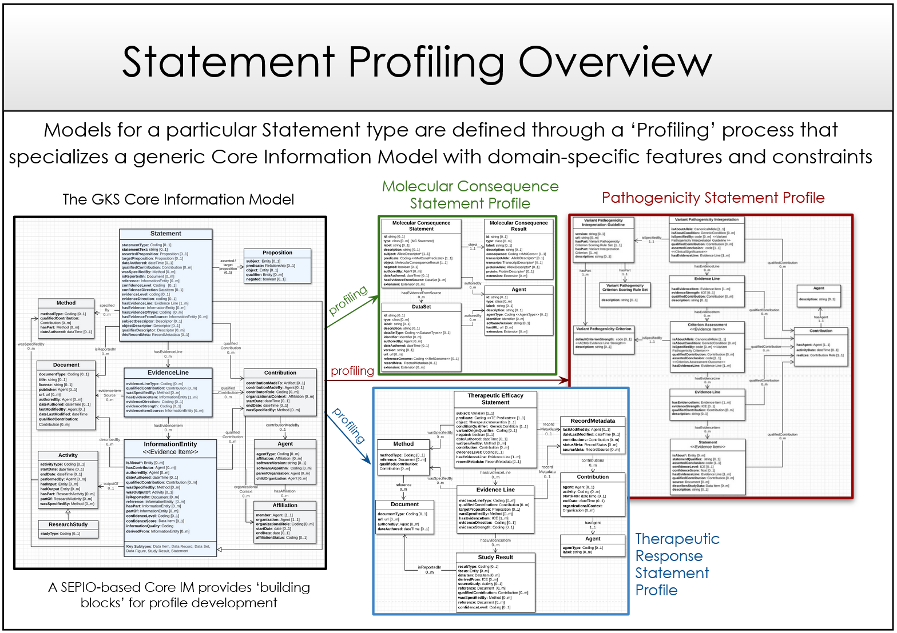

Profiling Methodology
!!!!!!!!!!!!!!!!!!!!!

``WORK IN PROGRESS: PLEASE COME BACK SOON`` 

--------------

Profiling Overview
*******************
In practice, application of the VA-Spec to represent actual data requires a 'Profiling' process, in which the generic GKS Core-IM is specialized represent types of Statements or Study Results. 

For example, the figure below shows how the Core-IM could be specialized into profiles for Variant Pathogenicity, Molecular Consequence, and Therapeutic Response Statements. 

Note that these profiles exhibit very different levels of complexity, to support the specific evidence and provenance requirements for each type of Statement.   

.. _statement_profiling

   Profiling of the GKS Core-IM

Profiling Tasks supported by the methodology include:

.. list-table::
   :class: clean-wrap
   :header-rows: 1
   :align: left
   :widths: auto

   *  - Profiling Task
      - Example
   *  - Select a subset of classes and attributes needed to represent the Statement/use case of interest 
      - Implementers may choose not to use the ``Evidence Line` class and related attributes in their profile.
   *  - Define domain-specific subtypes of general purpose Core IM classes 
      - Specialize ``Statement`` -> ``VariantPathogenicityStatement``
   *  - Specialize attributes to capture domain-specific information
      - Specialize ``Statement.qualifier`` -> ``VariantPathogenicityStatement.alleleoriginQualifier``
   *  - Define or import classes for domain entities that profiles Statements are about
      - For a Variant Pathogenicity Statement profile, classes to represent the subject ``Variation`` and object ``Disease`` 
   *  - Constrain values of Core IM attributes to take specific domain entities or data types as values
      - Restricting the ``VariantPathogenicityStatement.subject`` field to only take ‘Variation’ instances
   *  - Define value sets that get bound to attributes taking coded values
      - Binding ``VariantPathogenicityStatement.alleleoriginQualifier`` to take only `allele_origin <https://www.ebi.ac.uk/ols4/ontologies/geno/classes/http%253A%252F%252Fpurl.obolibrary.org%252Fobo%252FGENO_0000877>`_ terms from the GENO Ontology). 

The Profiles that result from these activities process represent custom, domain-specific information models that can be implemented as formal schema for a particular use case or application.  

The figure below shows a more detailed view of how a Variant Pathogenicity Statement Profile was generated by the ClinGen Driver Project to support representation of ClinVar data. 
.. _standard-profile-from-core-im:

.. figure:: images/standard-profile-from-core-im.png

   Profiling of the Core-IM into a Variant Pathogenicity Statement Profile

   **Legend** A Variant Pathogenicity Statement Profile is created through the profiling process whereby elements needed to support the ClinVar data. Examples of profiling specializations are shown in BLUE in the zoomed Variant Pathogenicity Statement class, including definition of this Statement subclass itself, binding of ``subject`` and ``object`` attributes to specific Domain Entity classes, definition of a specific ``qualifier`` class to capture gene context, and definition and binding of the ``predicate`` attribute to a specific enumeration of permissible values. 

The actual Statement Profile that results from this process is described `here <https://va-ga4gh.readthedocs.io/en/stable/standard-profiles/statement-profiles.html#variant-pathogenicity-statement>`_, and an example of ClinVar data structured using this profile is `here <https://va-ga4gh.readthedocs.io/en/stable/examples/variant-pathogenicity-statement.html>`_ 

Profiling Methodology Instructions
##################################

``COMING SOON``

The initial version of this methodology is informally specified as human-readable instructions, conventions, and examples.

Future work will provide templates and tooling that help implement and validate the methodology and its outputs.

Stay tuned for more on this . . . 

