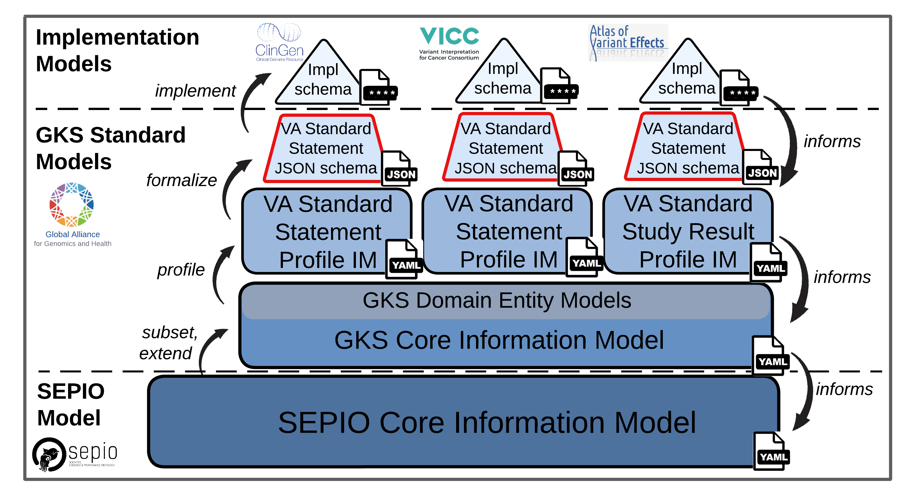

Quick Start Guide
!!!!!!!!!!!!!!!!!

``PREREQUISITES``: `Introduction <https://va-ga4gh.readthedocs.io/en/latest/introduction.html>`_

---------------

`VA Standard Profile schema <https://github.com/ga4gh/va-spec/tree/1.x/schema/profiles/json>`_ represent the final output of modeling efforts that unfold across a stack of dependent specifications. It is important to understand this hierarchy of models and their dependencies and interactions before beginning to use or contribute to the VA-Spec. 

This document provides an overview of these models and their depdneencies, links to resources for accessing and contributing to them, and a decision tree to help newcomers engage with the VA-Spec at the appropriate level for their data and use case.

Models and Dependencies
#######################
**Figure 1** illustrates the stack of models in the VA-Spec ecosystem, and highlighting dependencies and interactions between them. 

.. _va-model-layers:

   VA Models and Dependencies

   **Legend**  Models and dependencies in the VA-Spec ecosystem. Arrows on the left describe processes through which downstream models are generated from foundational ones. Arrows on the              right describe the propagation of requirements upstream to inform model expansion/refinement. Format of each model is indicated by icons at the left of each level.

* The **SEPIO Core-IM** provides foundational representation of domain-agnostic concepts describing the knowledge generation process, and artifacts it produces, and relationships between them. It is part of a larger modeling Framework that includes a Profiling Methodology for deriving models specialized for particular types of Statements reporting variant knowledge, or Study Results reporting cureated sets of variant data. It is written in a yaml format and not formalized as a json schema, as it is not intended to be directly implemented in data. 

* The **GKS Core-IM** represents a manually derived subset of the SEPIO Core-IM, that includes elements required by initial implementations of the VA-Spec. It is the basis for the profiling process that generates Statement or Study Result profiles for specific types of variant annotations. As existing VA profiles are expanded, or new profiles are created, the GKS Core-IM may pull in additional content from the SEPIO Core-IM to support these use cases. 

* **GKS Domain Entity IMs** are defined to represent the entities and concepts that Variant Annotations are about - e.g. Genes, Conditions, Therapeutic Procedures. These are used to represent the subjects, objects, and qualifiers in VA Statements. 

* **VA Standard Profile IMs** represent Standard Models for describing specific types of Statements or Study Results about molecular variation. They are generated through specializations of the GKS Core-IM.  They are defined as conceptual information models, and derived into formal json schema through the GKS Metaschema Processor tools.
  
**VA Standard Profile JSON Schema**: formal schema intended for use in data systems, which are generated automatically from the Standard Profile yaml source files by a metaschema processor pipeline. 

**Implementation schema**: concrete schema that are actually implemented in application data systems.  May directly implement VA Standard JSON schema, or specify custom versions of the standard models in a language of choice. May also make application-specific changes/additions to the standard models to support implementation needs. 

While the SEPIO and GKS Core models are the basis for deriving downstream VA profiles, the evolution of these core models is driven by bottom-up requirements arising from implementation models for working data applications. These requirements flow upstream to inform extension or refinement of the GKS Core-IM, and ultimately the SEPIO Core-IM - ensuring tight alignment across these models, and adherence to core modeling principles they espouse. 

Resources and Contributions
###########################
Below we list where each model resides, the specific location of the 'model source' yaml file(s) that are directly edited when defining a model, and a documentation landing page.

**SEPIO Core-IM**:
 * repo: 
 * model source:
 * documentation:

**GKS Core-IM**: 
 * repo: 
 * model source:
 * documentation:

**GKS Domain Entity IMS**: 
 * repo: 
 * model source:
 * documentation:

**VA Standard Profile IMs**:
 * repo: 
 * model source: 
 * documentation:

**VA Standard Profile JSON Schema**: 
 * repo: 
 * model source: n/a (these are automatically generated from standard profile source yaml files via metaschema processor tooling)
 * documentation:

**Implementation Schema**:
 * repo: distributed (like in repos associated with implementing projects)
 * model source: n/a (will be specific to each implementing project)
 * documentation: distributed (specific to each implementing project)

Where do I Start?
#################
As a modeling framework, there are many ways that users may engage with the VA-Spec. Some users may simply want to adopt an existing Standard Profile out-of-the-box for their data. Others may find an existing profile insufficient and wish to refine or extend it to meet their needs. And others may discover that no Standard Profiles yet exists for the type of knowledge they need to represent, and collaborate with the VA team to derive a new profile from the Core-IM.

The **decision tree** below is designed to help newcomers find the right entry point for engagement with the VA Framework, based on their data and project requirements.   
 * Follow the tree downward, choosing the appropriate path based on your data and project requirements. 
 * Blue nodes present a ``DECISION`` to be made.
 * Red nodes describe a terminal ``ACTION`` to be taken. 
 * Each node is numbered and maps to additional guidance and resources provided in the text below the tree. 

.. image:: images/quick-start-decision-tree.png
  :width: 1000

**Node Guidance and Resources:**

If you get stuck or have questions at any point in the process,  reach out to the VA Team for help - on Slack here, in the issue tracker here, or on our monthly community calls here.

#. ``DECISION``: **Does a Statement Profile exist for my use case?**
    #. Explore documentation about existing Statement Profiles `here <https://va-ga4gh.readthedocs.io/en/latest/standard-profiles/index.html>`_ to see if any cover the type of Statement you need to represent.

#. ``DECISION``: **Does the existing Statement Profile cover all my data and requirements?**
    #. Use the documentation for the existing profile `here <https://va-ga4gh.readthedocs.io/en/latest/standard-profiles/statement-profiles.html#variant-pathogenicity-statement>`_ to map your data onto the classes and attributes it provides. Note any data that is not accommodated by the existing model. 

#. ``DECISION``: **Does the GKS Core-IM contain elements needed to extend the Profile for my data?**
    #. Look at the generic `GKS Core-IM <https://va-ga4gh.readthedocs.io/en/latest/core-information-model/index.html>`_ to identify elements that might support your orphan data.

#. ``DECISION``: **Does upstream SEPIO Core-IM contain elements needed to define a Statement Profile for my data?**
    #. Look at the `SEPIO Core-IM <https://sepio-framework.github.io/sepio-linkml/>`_ to identify elements that might support your orphan data.
	
#. ``DECISION``: **Do I have the time and will to formally extend/refine the profile?**
    #. If you need the Profile to fully support the orphan data, but the GKS and SEPIO Core-IMs do not have the elements you need, extending the Statement Profile will require working with SEPIO and VA teams to extend these upstream models, and then pulling these new elements into the Profile. Please reach out to us for help. 
    #. While changes to these core models will require a bit more work, the close relationship between SEPIO and GKS developers will enable efficient coordination of effort and propagation of new modeling elements across these standards. 

#. ``ACTION``: **Formally extend/refine the Statement Profile to address my requirements**
    #. If you decide you want to work with the VA team to enhance the Profile to better support your data, start by adding proposed elements into the existing Statement Profile. 
    #. You may file a `Github Issue <https://github.com/ga4gh/va-spec/issues>`_ describing your needs, make a `Pull Request <https://github.com/ga4gh/va-spec/pulls>`_ on the Profile proposing model updates, or reach out for help via the communication channels listed above.  
    #. The VA Team will coordinate discussions with other implementers to ensure the proposed changes are amenable to implementation needs and aligned with broader VA modeling principles. 
    #. We will also coordinate discussions with SEPIO developers to propagate requested changes from the Profile upstream to GKS and SEPIO Core IMs. 
	
#. ``ACTION``: **Adopt the Statement Profile as is**
    #. If the existing profile covers the data you need it to, you can find its json schema specification `here <https://github.com/ga4gh/va-spec/tree/1.x/schema/profiles/json>`_ for implementation in your system.

#. ``ACTION``: **Extend the Statement Profile using these GKS Core-IM elements**
    #. Add the new Core-IM elements to the existing Profile, following the Profiling Methodology Guidance `here <https://va-ga4gh.readthedocs.io/en/latest/profiling-methodology.html>`_ to specialize them for your data as needed.

#. ``ACTION``: **Pull required elements from the SEPIO Core-IM into the GKS Core-IM, and build Statement Profile**
    #. Contact the VA team for help pulling these into the GKS Core-IM.
    #. These new Core-IM elements can then be pulled into the existing Profile, following the Profiling Methodology Guidance `here <https://va-ga4gh.readthedocs.io/en/latest/profiling-methodology.html>`_ to specialize them for your data as needed.

#. ``ACTION``: **Adopt Statement Profile as is, and use 'Extensions' for unsupported data as desired**
    #. If it acceptable that the Profile does not directly support the orphan data, you can use the `Extension <https://va-ga4gh.readthedocs.io/en/latest/core-information-model/data-types.html#extension>`_ modeling pattern capture this data informally, and still be in compliance with the Profile specification. 
	b. We suggest that you still file a `Github Issue <https://github.com/ga4gh/va-spec/issues>`_ describing your unmet need, so that we might one day add support to the model, and notify you if/when this happens. 

#. ``DECISION``: **Does the GKS Core-IM contain elements needed to define a new Profile for my data?**
    #. If none of the existing Standard Profiles matches your data, you will have to help us create one!
    #. You can follow the Profiling Methodology Guidance `here <https://va-ga4gh.readthedocs.io/en/latest/profiling-methodology.html>`_.
    #. An initial step is to look at the generic `GKS Core-IM <https://va-ga4gh.readthedocs.io/en/latest/core-information-model/index.html>`_ to identify elements needed to support your data, and note any gaps that may exist. 

#. ``DECISION``: **Does upstream SEPIO Core-IM contain elements needed to define a Statement Profile for my data?**
    #. If the GKS Core-IM does not support all of your data, look to the upstream `SEPIO Core-IM <https://sepio-framework.github.io/sepio-linkml/>`_ from which it was derived. 
    #. It will have a larger selection of elements that can be pulled into the GKS Core-IM as needed. 
    #. Note elements that you want to pull into the GKS Core-IM, as well as any data that for which it does not offer support. 
	
#. ``DECISION``: **Do I have the time and will to implement Core-IM changes to support my needs?**
    #. If you need the Profile to fully support the orphan data, but the GKS and SEPIO Core-IMs do not have the elements you need, building your Profile will require working with SEPIO and VA teams to extend these upstream models, and then pulling these new elements into the Profile. Please reach out to us for help. 
    #. While changes to these core models will require a bit more work, the close relationship between SEPIO and GKS developers will enable efficient coordination of effort and propagation of new modeling elements across these standards.
	
#. ``ACTION``: Build Profile from existing Core-IM elements, use  'Extensions' to capture unsupported data
    #. If it acceptable that the Profile does not directly support the orphan data, you can use the `Extension <https://va-ga4gh.readthedocs.io/en/latest/core-information-model/data-types.html#extension>`_ modeling pattern capture this data informally, and still be in compliance with the Profile specification. 
    #. We suggest that you still file a `Github Issue <https://github.com/ga4gh/va-spec/issues>`_ describing your unmet need, so that we might one day add support to the model, and notify you if/when this happens. 

#. ``ACTION``: Build new Statement Profile on the existing GKS Core-IM
    #. If the GKS Core-IM has what you need to represent your data, follow the `Profiling Methodology <https://va-ga4gh.readthedocs.io/en/latest/profiling-methodology.html>`_ to derive a Profile for your new Statement type.  Reach out for help as you go, and submit a `Pull Request <https://github.com/ga4gh/va-spec/pulls>`_ when you have a draft ready to share.
    #. If the GKS Core-IM is lacking, consult the upstream SEPIO Core-IM to see if it contains the elements you need. If it does, contact the VA team for help pulling these into the GKS Core-IM, so they can be used in your Profile.
    #. If neither Core-IM has what you need, building your Statement Profile may require working with SEPIO and VA teams to add support to these upstream models, and then pulling these new elements into your Profile.  Reach out and we will be happy to help.

#. ``ACTION``: Pull required elements from the SEPIO Core-IM into the GKS Core-IM, and build Statement Profile 
    #. Contact the VA team for help pulling these into the GKS Core-IM.
    #. These new Core-IM elements can then be pulled into your new Profile, following the Profiling Methodology Guidance `here <https://va-ga4gh.readthedocs.io/en/latest/profiling-methodology.html>`_ to specialize them for your data as needed.

#. ``ACTION``: Work with SEPIO / GKS teams to change Core-IM models, then build Statement Profile on them
    #. If you decide you want to work with the VA team to create a Statement Profile that fully  supports your data, start by adding the proposed new elements into your Statement Profile. 
    #. When a draft of your new Profile is ready for review, make a `Pull Request <https://github.com/ga4gh/va-spec/pulls>`_ to initiate a broader review.  
    #. The VA Team will coordinate discussions with other implementers to ensure the proposed changes are amenable to implementation needs and aligned with broader VA modeling principles. 
    #. We will also coordinate discussions with SEPIO developers to add new elements to these models as appropriate, ensuring compliance with these upstream standards.  

Note that the decision tree above focuses on getting you to a **Statement** Profile for your data,  but the same workflow and recommendations apply for **Study Result** Profiles.

-----------------

**Attic:**

Evolution of SEPIO and GKS Core Information Models is driven by bottom-up requirements arising from implementations developing profiles for working data applications.  These requirements flow upstream to inform extension or refinement of the GKS Core-IM, and ultimately the SEPIO Core-IM - ensuring tight alignment across these models, and adherence to core modeling pricniples they espouse. 

`VA Standard Profile schema <https://github.com/ga4gh/va-spec/tree/1.x/schema/profiles/json>`_ represent the endpoint of modeling efforts that unfold across a stack of dependent specifications. It is important to understand this hierarchy of models and their dependencies and interactions before beginning to use or contribute to the VA-Spec.  Figure 1 illustrates the relationships between assets supporting the VA-Spec. 

