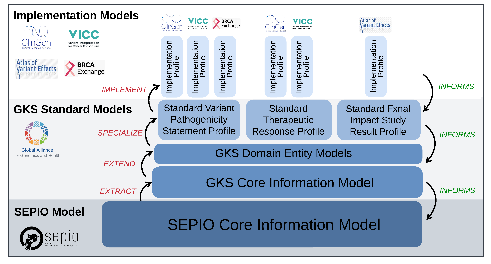
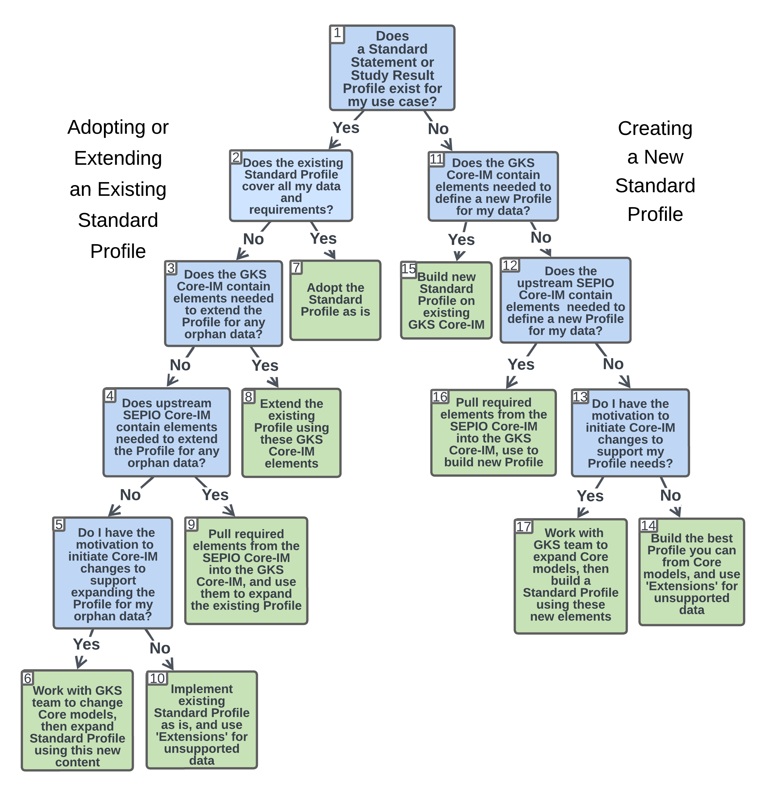

.. _quick-start-guide:

Quick Start Guide
!!!!!!!!!!!!!!!!!

``PREREQUISITES``: :ref:`Introduction<introduction>`

Models and Dependencies
#######################

`VA Standard Profile schema <https://github.com/ga4gh/va-spec/tree/1.x/schema/profiles/json>`_ represent the final output of modeling efforts that unfold across a hierarchy of dependent models and specifications, as depicted below and described in detail in the :ref:`Introduction <va-standard-development-and-dependencies>`. 

.. important::  It is **critical that developers understand this ecosystem of models and their dependencies** before beginning to use or contribute to the VA-Spec. 

.. _va-model-dependencies:

   Ecosystem of VA Models and Dependencies

   **Legend** A hierarchy of models support generation of the Standard Profiles that are the final product of the VA-Specification. Arrows on the left describe PROCESSES through which downstream models are built on more foundational ones. Arrows on the right describe the propagation of requirements from implementation models to INFORM upstream model expansion and refinement.

An overview of the interactions between repositories housing these models, along with links to source models and documentation, is provided at the :ref:`Github Repositories appendix<github-repositories>`.  

Where do I Start?
#################

Adopters will come to the VA-Spec with some requirements or representation of variant knowledge - be it an explicit model, or models implicit in data collection forms or data examples. There are **many ways these adopters may engage with the VA-Spec** as a Modeling Framework:

 * Some may simply want to **adopt an existing Standard Profile**  out-of-the-box for their data.
 * Some may find an existing Standard insufficient - and wish to refine or **extend an existing Profile** to meet their needs. 
 * Some may discover that no Profile yet exists for the type of knowledge they want to represent, and collaborate with the VA team to **define a new Standard Profile** from the GKS Core-IM.

The **Descision Tree** below is designed to help adopters decide among and execute these options.

 * Follow the tree downward, choosing the appropriate path based on your data and project requirements.
 * Blue nodes present a **DECISION** to be made. Green nodes describe a terminal **ACTION** to be taken.  
 * Guidance to help you make decisions or perform actions is provided below the tree, organized by node number.

.. _quick-start-decision-tree:

   Decision Tree to guide Engagement of Adopters with the VA-Spec

   **Legend** The path on the **left** guides users in adopting or extending an existing Standard Profile. The path on the **right** guides users in creating an entirely new Standard Profile.

**Node Guidance and Resources:**
Note that the workflow and guidance provided is the same for :ref:`Statement Profiles <statement-profiles>`, which are used to represent discrete assertions of variant knowledge (e.g. a pathogenicity classification), or :ref:`Study Result Profiles <statement-profiles>`, which are used to capture collections of data about a single variant from a particular study or analysis dataset (e.g. from the gnomAD cohort allele frequency dataset). 

#. ``DECISION``: **Does a Standard Statement or Study Result Profile exist for my use case?**
    * Explore existing Standard Profiles :ref:`here <standard-profiles>` to see if any cover the type of Statement or Study Result you want to represent.

#. ``DECISION``: **Does the existing Standard Profile cover all my data and requirements??**
    * Use the documentation for the Profile (e.g. :ref:`here <variant-pathogenicity-statement-profile>`) to map your data or model onto the classes and attributes the Profile  provides, noting any data that is not accommodated. 

#. ``DECISION``: **Does the GKS Core-IM contain elements needed to extend the existing Profile for any 'orphan' data?**
    * Explore the :ref:`GKS Core-IM <core-im>` to identify elements that might support your 'orphan' data (i.e. data items that are not supported by the existing Profile).

#. ``DECISION``: **Does upstream SEPIO Core-IM contain elements needed to extend the Profile for any orphan data??**
    * Explore the `SEPIO Core-IM <https://sepio-framework.github.io/sepio-linkml/>`_ to identify elements that might support your orphan data.
	
#. ``DECISION``: **Do I have the motivation to initiate Core-IM changes to support expanding the Profile for my orphan data??**
    * Consider if you need the Standard Profile to fully support all your data, given your use case, and the option to use :ref:`Extension <Extension>` element. 
    * If you do, extending the Standard Profile will require working with SEPIO and VA teams to extend these upstream models, and then pulling these new elements into the Profile.
    * While changes to these core models will require a bit more work, the close relationship between SEPIO and GKS developers will enable efficient coordination of effort and propagation of new modeling elements across these core models. Please reach out to us for help. 

#. ``ACTION``: **Work with GKS team to change Core models, then expand Standard Profile using this new content**
    * If you decide you want to work with the VA team to enhance the Standard Profile to better support your data, make a concrete proposal for the changes or additions you need.
    * You may file a `Github Issue <https://github.com/ga4gh/va-spec/issues>`_ describing the proposed enhancements, or create them in a branch of the Profile and submit a `Pull Request <https://github.com/ga4gh/va-spec/pulls>`_.  
    * The VA Team will coordinate discussions with other implementers and upstream standards to ensure the proposed changes are amenable to implementation needs and aligned with broader VA modeling principles, and any changes made are propagated to GKS and SEPIO models. 
	
#. ``ACTION``: **Adopt the Standard Profile as is**
    * If the existing profile sufficiently supports your data and requirements, you can find its json schema specification `here <https://github.com/ga4gh/va-spec/tree/1.x/schema/profiles/json>`_ for implementation in your system.

#. ``ACTION``: **Extend the existing Profile using these GKS Core-IM elements**
    * Add the new Core-IM elements to the existing Profile, following the Profiling Methodology :ref:`here <profiling-methodology>` to specialize them for your data as needed.

#. ``ACTION``: **Pull required elements from the SEPIO Core-IM into the GKS Core-IM, and use them to expand the existing Profile**
    * Make a ticket or PR yourself, or contact the VA team for help pulling these elements into the GKS Core-IM.
    * These new Core-IM elements can then be included and specialized as needed into the existing Profile, following the Profiling Methodology Guidance :ref:`here <profiling-methodology>`.

#. ``ACTION``: **Implement existing Standard Profile as is, and use 'Extensions' for unsupported data**
    * If it acceptable that the Profile does not directly support the orphan data in your specific implementation, you can use the :ref:`Extension <Extension>` modeling pattern capture this data, and still be in compliance with the Profile specification. 
    * Alternatively, your implementation model can define bespoke attributes for this data, but these will not be compliant with the standard Profile. 
    * Regardless of your approach, we suggest that you file a `Github Issue <https://github.com/ga4gh/va-spec/issues>`_ describing your unmet need, so that we might one day add support to the model, and notify you when this happens. 

#. ``DECISION``: **Does the GKS Core-IM contain elements needed to define a new Profile for my data?**
    * If none of the existing Standard Profiles matches your data, you will have to help us create one!
    * You can follow the Profiling Methodology Guidance :ref:`here <profiling-methodology>`.
    * An initial step is to look at the generic :ref:`GKS Core-IM <core-im>` to identify elements needed to support your data, and note any gaps that may exist. 

#. ``DECISION``: **Does the upstream SEPIO Core-IM contain elements  needed to define a new Profile for my data??**
    * If the GKS Core-IM does not support all of your data, look to the upstream `SEPIO Core-IM <https://sepio-framework.github.io/sepio-linkml/>`_ from which it was derived. 
    * It will have a larger selection of elements that can be pulled into the GKS Core-IM as needed. 
    * Note elements that you want to pull into the GKS Core-IM, as well as any data that for which it does not offer support. 
	
#. ``DECISION``: **Do I have the motivation to initiate Core-IM changes to support my Profile needs??**
    * If you need the Profile to fully support the orphan data, but the GKS and SEPIO Core-IMs do not have the elements you need, building your Profile will require working with SEPIO and VA teams to extend these upstream models, and then pulling these new elements into the Profile. Please reach out to us for help. 
    * While changes to these core models will require a bit more work, the close relationship between SEPIO and GKS developers will enable efficient coordination of effort and propagation of new modeling elements across these standards.
	
#. ``ACTION``: **Build the best Profile you can from Core models, and use  'Extensions' for unsupported data**
    * If it acceptable that the Profile does not directly support the orphan data in your specific implementation, you can use the :ref:`Extension <Extension>` modeling pattern capture this data informally, and still be in compliance with the Profile specification. 
    * Alternatively, your implementation model can define bespoke attributes for this data, but these will not be compliant with the standard Profile. 
    * Regardless of your approach, we suggest that you file a `Github Issue <https://github.com/ga4gh/va-spec/issues>`_ describing your unmet need, so that we might one day add support to the model, and notify you when this happens. 

#. ``ACTION``: **Build new Standard Profile on existing GKS Core-IM**
    * If the GKS Core-IM has what you need to represent your data, follow the :ref:`Profiling Methodology <profiling-methodology>` to derive a Profile for your new Statement or study Result type.  Reach out for help as you go, and submit a `Pull Request <https://github.com/ga4gh/va-spec/pulls>`_ when you have a draft ready to share.
    * If the GKS Core-IM is lacking, consult the upstream SEPIO Core-IM to see if it contains the elements you need. If it does, contact the VA team for help pulling these into the GKS Core-IM, so they can be used in your Profile.
    * If neither Core-IM has what you need, building your Standard Profile may require working with SEPIO and VA teams to add support to these upstream models, and then pulling these new elements into your Profile.  Reach out and we will be happy to help.

#. ``ACTION``: **Pull required elements from the SEPIO Core-IM into the GKS Core-IM, and use to build new Profile**
    * Contact the VA team for help pulling these into the GKS Core-IM.
    * These new Core-IM elements can then be pulled into your new Profile, following the Profiling Methodology Guidance :ref:`here <profiling-methodology>` to specialize them for your data as needed.

#. ``ACTION``: **Work with GKS team to expand Core models, then build a Standard Profile using these new elements**
    * If you decide you want to work with the VA team to create a Standard Profile that fully supports your data, start by adding the proposed new elements into your Standard Profile. 
    * When a draft of your new Profile is ready for review, make a `Pull Request <https://github.com/ga4gh/va-spec/pulls>`_ to initiate a broader review.  
    * The VA Team will coordinate discussions with other implementers to ensure the proposed changes are amenable to implementation needs and aligned with broader VA modeling principles. 
    * We will also coordinate discussions with SEPIO developers to add new elements to these models as appropriate, ensuring compliance with these upstream standards.  

.. important:: While this workflow suggests a top-down approach for defining Standard Profiles on top of foundational core models, the process is very much **driven by implementation requirements** in a bottom-up manner. New Standards begin as **Draft Implementation Profiles**, which are informed by Core-IM elements, but ultimately based on the needs of their specific application. These draft profiless are evolved into VA Standards as the VA Team works with implementers and standards developers to align initial implementation models with foundational core models and principles (see :ref:`here <establishing-and-evolving-va-standards>`).

.. important:: 
 * While this workflow suggests a top-down approach for defining Standard Profiles on top of foundational core models, the process is very much **driven by implementation requirements** in a bottom-up manner. 
 * New Standards begin as **Draft Implementation Profiles**, which are informed by Core-IM elements, but ultimately based on the needs of their specific application.  
 * These draft profiless are evolved into VA Standards as the VA Team works with implementers and standards developers to align initial implementation models with foundational core models and principles (see :ref:`here <establishing-and-evolving-va-standards>`).

