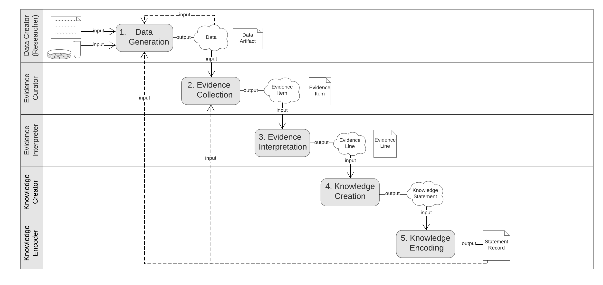

Domain Analysis Model
!!!!!!!!!!!!!!!!!!!!!

**Milestones and Deliverables**

.. list-table::
   :class: clean-wrap
   :header-rows: 1
   :align: left
   :widths: auto
   
   *  - Version
      - Target Date
      - Deliverable 
 
   *  - v1
      - Q3 2023
      - Initial iteration of the complete domain model

   *  - v2
      - Q1 2024
      - Revised version taking into account new feedback and requirements
      
Overview
@@@@@@@@

The VA Domain Analysis Model (DAM) is specified here as a UML-style Activity model which depicts the universal activities performed in generating and encoding evidence-based knowledge of any kind. It provides shared foundational understanding of the domain the Core Information Model aims to represent.  As an objective view of reality, it provides a common perspective from which to approach application of the VA Framework - where it can help guide requirements analysis, inform definition of VA Proifiles, and aid in mapping source data to a VA-compliant representation.

   **Figure 1:** The VA Domain analysis Model: Each lane represents one of the five universal 
   tasks that contribute to geenration and encoding of scientific knowledge. Grey boxes name the 
   task, and arrows and images describe the inouts and outputs of each. At the left of each lane 
   are the roles played by actors in the process, which may be performed by the same or different 
   actors depending on how the full knowledge creation process unfolds. 

  **Table 1** below describes each of the five universal tasks depicted in the DAM.

.. list-table::
   :class: clean-wrap
   :header-rows: 1
   :align: left
   :widths: auto
   
   *  - Task
      - Description
      - Inputs 
      - Outputs
 
   *  - **Data Generation**
      - Creation and recording of novel scientific data and insights by researchers or clinicians, through observation, experimentation, statistical analysis, computational models/simulations, etc.
      - Research subjects, protocols, research resources, reagents, data, computational tools 
      - Research data, typically reported in data sets/records, figures, publications, . . .

   *  - **Evidence Curation**
      - Collected, organization, and preparation of relevant information for interpretation as evidence to a particular proposition
      - Datasets, KBs/DBs, publications, other knowledge resources 
      - Curated Evidence Items (staged for interpretation as evidence) 

   *  - **Evidence Interpretation**
      - The grouping and evaluation of Evidence Items to build discrete arguments for or against a possible fact
      - Evidence Items, evidence evaluation guidelines/protocols 
      - One or more discrete arguments (Evidence Lines) arguing for or against the target proposition 

   *  - **Knowledge Assertion**
      - Statement of a final conclusion, based on the collective assessment of all relevant arguments (Evidence Lines)
      - One or more Evidence Lines (which may support or dispute the stated fact)
      - A purported fact expressing knowledge about the domain of discourse.

   *  - **Knowledge Encoding**
      - The expression/codification of the knowledge created in a concrete form 
      - An statement of knowledge (in the abstract)
      - A concrete artifact expressing the stated knowledge in a specific format and syntax (e.g. narrative text, a structured data object such as a json object, or an rdf triple)
      
In practice, each of these tasks may be carried out with varying degrees of formalization and rigor. They may be performed as part of a systematic curation and reasoning workflow (e.g. variant interpretation using the ACMG Guidelines), they may be executed almost entirely in silico (e.g computational predictions of functional impact or molecular consequence), or they may be the result of good ol’ fashioned sitting and thinking - absent any formal framework or computational support. Regardless, each of  the tasks shown here is performed in some form or fashion, and it is up to implementers to decide at what level of detail they want to represent information about each in their Profile.
