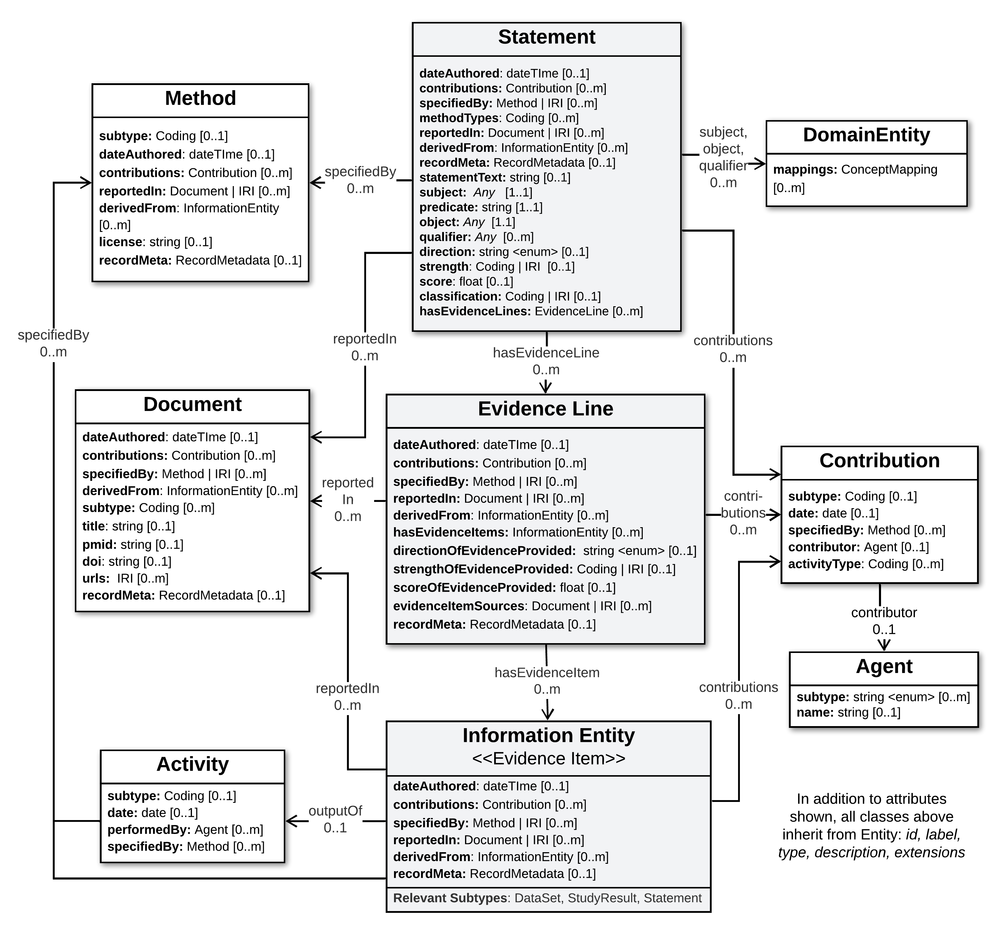

.. _statement-profiles:

Statement Profiles
!!!!!!!!!!!!!!!!!!

In the **GKS-Core-IM**, each discrete assertion of knowledge is captured in a self-contained ``Statement`` object which roots a :ref:`data structure <core-im-statement-data-structure>` supporting rich and flexible descriptions of the evidence and provenance supporting this knowledge. 

**Statement Profiles** are defined as specializations of this Core-IM ``Statement`` class, to provide a concrete schema for representing a particular type of Variant knowledge (e.g. variant pathogenicity classifications).

The basic structure of Statement Profiles built on the Core-IM is illustrated below. The process used to specialize this structure for a specific Statement type is described in the :ref:`Profiling Methodology<profiling-methodology>`.

.. _statement-data-structure:

   Statement Data Structure

   **Legend** Presents a view of the core data structure rooted by the Statement class, which can be leveraged in defining a Statement Profile. This view focuses on the most important and commonly used attributes and relationships in the model. Note that in addition to attributes shown, all classes above inherit from Entity: id, label, type, description, extensions
---------

Below are the **Standard Statement Profiles** currently defined as part of the VA-Spec, and available for adoption or extension by Driver Project implementations. **JSON Schema** for each Profile can be found `here <https://github.com/ga4gh/va-spec/tree/1.x/schema/profiles/json>`_. 

.. _variant-pathogenicity-statement-profile:

Variant Pathogenicity Statement
###############################

An example of data structured using this Standard Profile can be found `here <https://va-ga4gh.readthedocs.io/en/stable/examples/variant-pathogenicity-statement.html>`_.

.. include::  ../../../schema/profiles/def/VariantPathogenicityStatement.rst

Variant Oncogenicity Study Statement
##############################

.. include::  ../../../schema/profiles/def/VariantOncogenicityStudyStatement.rst

Variant Therapeutic Response Study Statement
#############################################

.. include::  ../../../schema/profiles/def/VariantTherapeuticResponseStudyStatement.rst

.. _variant-diagnostic-statement-profile:

Variant Diagnostic Study Statement
##################################

.. include::  ../../../schema/profiles/def/VariantDiagnosticStudyStatement.rst

Variant Prognostic Study Statement
##################################

.. include::  ../../../schema/profiles/def/VariantPrognosticStudyStatement.rst

